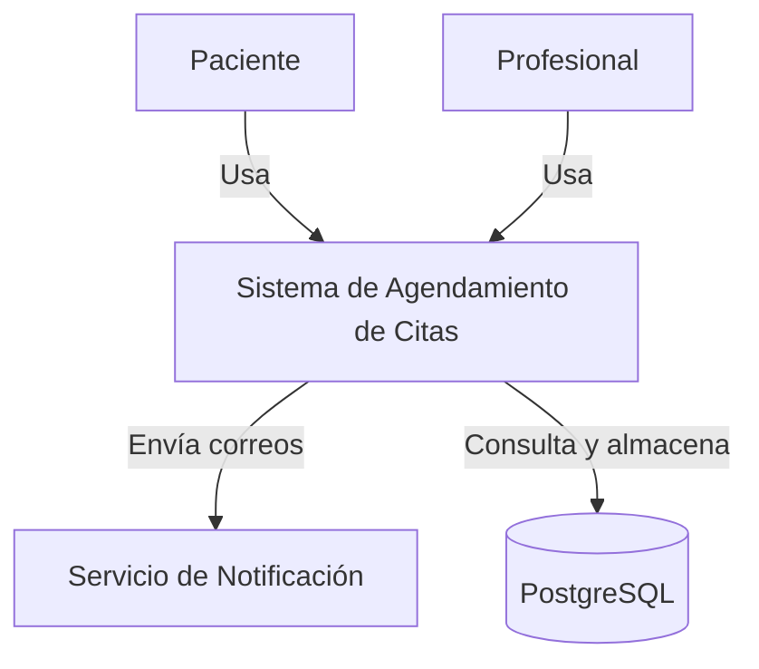
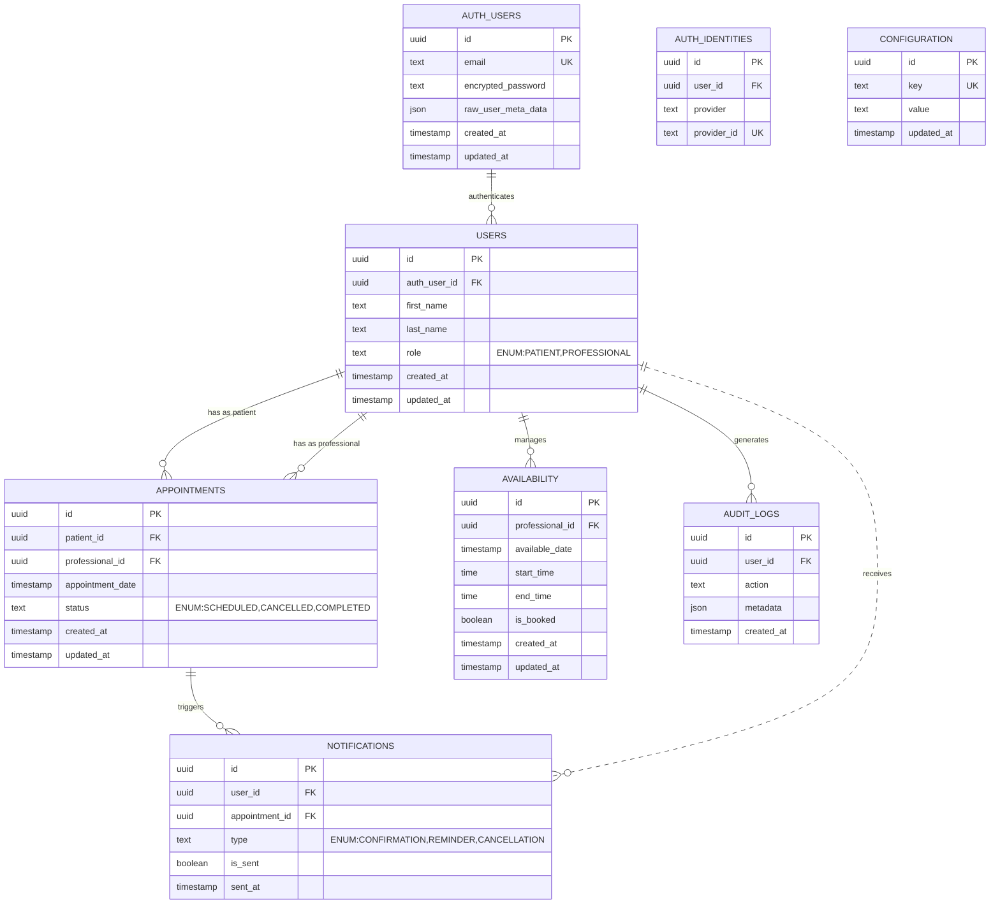
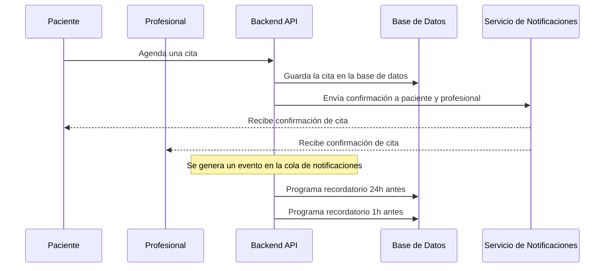
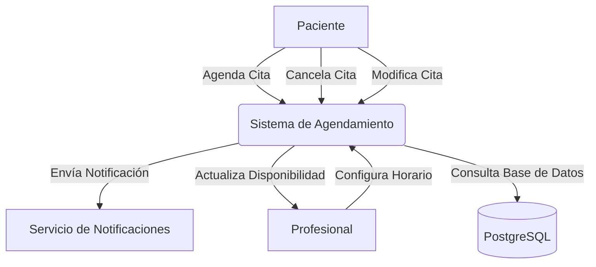
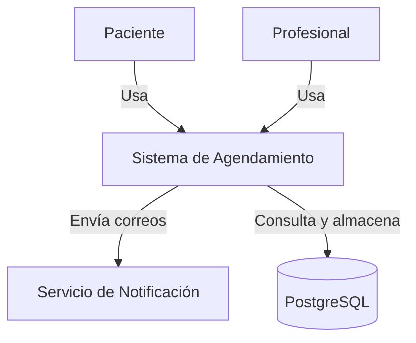
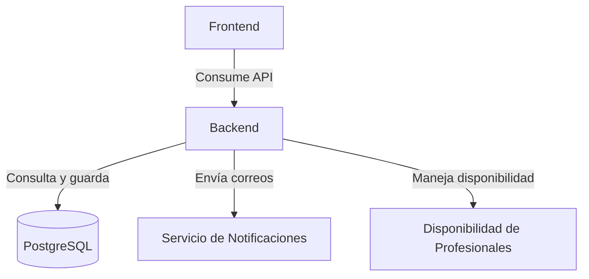
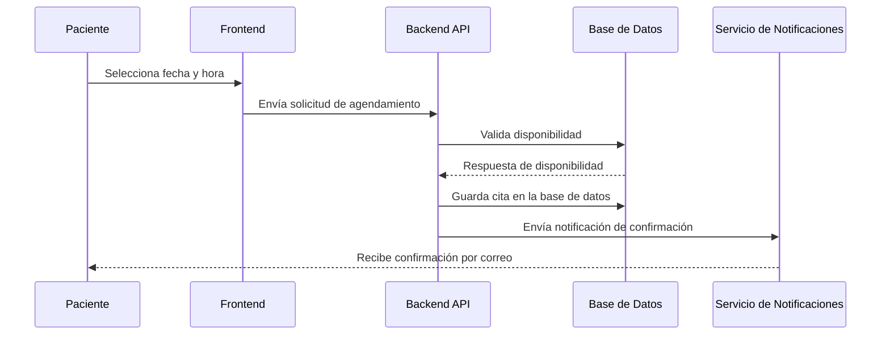
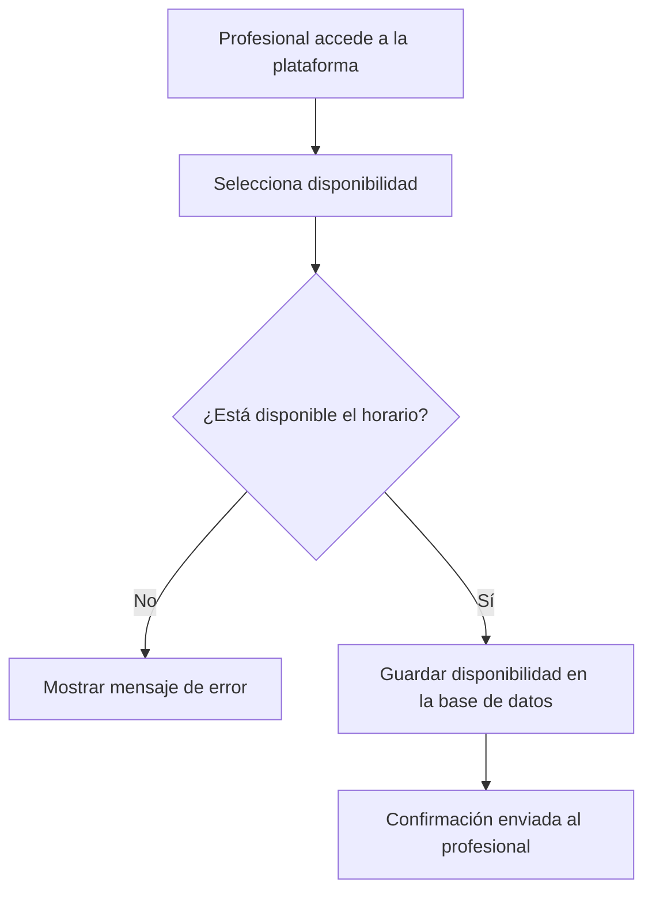
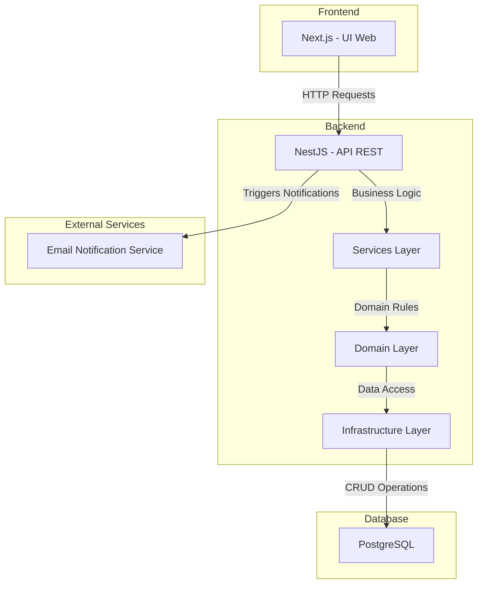

# **Architecture Requirements Document (ARD)**

## **1. Introducción**

### **1.1 Propósito del Documento**  
El propósito de este **Architecture Requirements Document (ARD)** es proporcionar una descripción detallada de la arquitectura del **MVP del Sistema de Agendamiento de Citas**. Este documento servirá como referencia para el equipo de desarrollo, asegurando que el diseño y la implementación del sistema sigan una estructura sólida, escalable y alineada con los objetivos del negocio.  

### **1.2 Alcance de la Arquitectura**  
El alcance de este documento está limitado a la **arquitectura del MVP**, considerando los siguientes aspectos:  
- Implementación de una plataforma de **agendamiento de citas** entre pacientes y profesionales.  
- Gestión de disponibilidad **manual** por parte de los profesionales.  
- Notificaciones por **correo electrónico** para confirmaciones y recordatorios de citas.  
- Uso de tecnologías seleccionadas:  
  - **Backend:** NestJS  
  - **Frontend:** NextJS  
  - **Base de Datos:** PostgreSQL  
- Despliegue en un entorno de **alta disponibilidad** con enfoque en escalabilidad básica.  

**Exclusiones del Alcance:**  
- No se abordará la integración con **pasarelas de pago** ni con **calendarios externos**.  
- No se incluirán funcionalidades avanzadas como **reportes y métricas**.  
- No se implementará un sistema de autenticación de usuarios en esta fase.  

### **1.3 Objetivos y Consideraciones Claves**  
Los objetivos de la arquitectura del MVP incluyen:  
✅ **Simplicidad y rapidez en la implementación:** Diseñar un sistema ligero y funcional en el menor tiempo posible.  
✅ **Escalabilidad futura:** Aunque es un MVP, la arquitectura debe permitir futuras mejoras sin cambios disruptivos.  
✅ **Alta disponibilidad:** Garantizar un **99% de tiempo operativo**, asegurando confiabilidad en la gestión de citas.  
✅ **Seguridad de los datos:** Cumplir con las mejores prácticas en protección de información personal y privacidad.  
✅ **Facilidad de uso:** Asegurar que la experiencia de usuario sea intuitiva y accesible, cumpliendo con estándares **WCAG**.  

---


## **2. Arquitectura General**  

### **2.1 Visión General del Sistema**  
El sistema de agendamiento de citas es una aplicación **web** diseñada para facilitar la gestión de citas entre **pacientes y profesionales**. La arquitectura sigue un enfoque basado en **microservicios ligeros**, permitiendo modularidad y facilidad de escalabilidad en futuras iteraciones.  

El sistema se compone de tres capas principales:  
1. **Capa de Presentación (Frontend - NextJS)**: Interfaz web accesible para pacientes y profesionales.  
2. **Capa de Aplicación (Backend - NestJS)**: API REST responsable de la lógica de negocio y gestión de datos.  
3. **Capa de Datos (PostgreSQL)**: Base de datos relacional encargada de almacenar información de citas y usuarios.  

📌 **Principios Arquitectónicos Aplicados:**  
✅ **Separación de responsabilidades:** Distinción clara entre presentación, lógica y datos.  
✅ **Escalabilidad modular:** Capacidad para agregar nuevas funcionalidades sin afectar la estabilidad.  
✅ **Seguridad y disponibilidad:** Protección de datos y operación confiable con redundancia.  

### **2.2 Diagrama de Contexto (C4 - Nivel 1)**  
A continuación, se presenta un **Diagrama de Contexto (Nivel 1)** que ilustra la relación del sistema con sus usuarios y servicios externos:



📌 **Explicación:**  
- Los **pacientes y profesionales** interactúan con el sistema a través de la interfaz web.  
- El sistema se comunica con un **servicio de correo** para enviar notificaciones.  
- La base de datos almacena y recupera información sobre usuarios, citas y disponibilidad.  

### **2.3 Principales Componentes del Sistema**  
El sistema está compuesto por los siguientes módulos clave:

| **Componente**       | **Descripción** |
|----------------------|------------------------------------------------------|
| **Interfaz Web (NextJS)** | Plataforma para que los usuarios gestionen sus citas. |
| **API Backend (NestJS)** | Exposición de endpoints REST para manejar la lógica del sistema. |
| **Base de Datos (PostgreSQL)** | Almacén de datos estructurados para la gestión de citas y usuarios. |
| **Servicio de Notificaciones** | Mecanismo de envío de correos de confirmación y recordatorios. |

### **2.4 Decisiones Arquitectónicas Claves**  
📌 **Decisiones tomadas:**  
- Se optó por una **arquitectura basada en APIs REST** en lugar de GraphQL para simplicidad en el desarrollo del MVP.  
- Uso de **NextJS** en el frontend por su capacidad de renderizado híbrido y su compatibilidad con futuras mejoras.  
- Se eligió **PostgreSQL** debido a su estabilidad, capacidad de escalabilidad y soporte de integridad referencial.  
- Se dejó abierta la posibilidad de migrar a **una arquitectura basada en eventos** en futuras iteraciones para mejorar el procesamiento asíncrono.  

📌 **Trade-offs identificados:**  
- No se implementará autenticación en el MVP, lo que limita la personalización de la experiencia del usuario.  
- Se usará una estructura monolítica en el backend inicialmente, con la posibilidad de modularizar servicios en el futuro.  

---


# **3. Diseño de Componentes**  

## **3.1 Backend**  

El backend del sistema sigue una arquitectura basada en principios de **Domain-Driven Design (DDD)**, con una implementación estructurada mediante **Hexagonal Architecture**, **Clean Architecture**, y utilizando enfoques como **Vertical Slicing** y **Screaming Architecture** para mejorar la mantenibilidad y escalabilidad del código.  

### **3.1.1 Principios y Arquitecturas Aplicadas**  

✅ **Domain-Driven Design (DDD)**  
- Se han agregado **módulos específicos** para la gestión de disponibilidad y validación de reglas de negocio.  
- Cada módulo encapsula su lógica y evita dependencias innecesarias.  

✅ **Hexagonal Architecture**  
- Se han definido **puertos y adaptadores** para manejar la **actualización de disponibilidad en tiempo real**.  
- Implementación de adaptadores para la integración con **servicios de mensajería en tiempo real**.  

✅ **Vertical Slicing**  
- Separación modular de **Citas**, **Disponibilidad**, **Notificaciones** y **Reglas de Negocio**.  
- Cada funcionalidad se encapsula en su propio módulo para garantizar mantenibilidad y escalabilidad.  

✅ **Event-Driven Architecture**  
- Se han introducido eventos internos para gestionar la **actualización de disponibilidad** y evitar conflictos en la asignación de citas.  
- Uso de **mensajes en tiempo real** para reflejar cambios en la agenda de los profesionales.  

📌 **Patrones de Diseño Implementados:**  

| **Patrón** | **Descripción** |
|------------|------------------------------------------------------|
| **Repository Pattern** | Separa la lógica de acceso a datos de la lógica de negocio. |
| **Observer Pattern** | Implementado para **actualización en tiempo real de la disponibilidad** de los profesionales. |
| **Event-Driven Architecture** | Manejo de eventos para reflejar cambios de disponibilidad sin bloquear operaciones críticas. |
| **Factory Pattern** | Creación de objetos complejos en los casos de uso de citas y disponibilidad. |

---

### **3.1.2 Stack Tecnológico y Herramientas**  
- **Lenguaje:** TypeScript  
- **Framework:** NestJS  
- **ORM:** Prisma (para gestionar la base de datos con PostgreSQL)  
- **Validación:** Zod (validación de datos)  
- **Mensajería/Colas:** RabbitMQ (para procesamiento asíncrono en el futuro)  
- **Autenticación:** No incluida en el MVP, pero se prevé JWT en versiones futuras  

---

### **3.1.3 Patrones de Diseño Implementados**  
| **Patrón** | **Descripción** |
|------------|------------------------------------------------------|
| **Repository Pattern** | Separa la lógica de acceso a datos de la lógica de negocio. |
| **Dependency Injection** | Se utiliza el módulo de inyección de dependencias de NestJS para mejorar testabilidad y modularidad. |
| **Factory Pattern** | Se usa para la creación de objetos complejos en los casos de uso. |
| **Observer Pattern** | Utilizado para gestionar eventos internos, como notificaciones. |

---

## **3.2 Frontend**  

El frontend está desarrollado con **Next.js**, aprovechando su flexibilidad en **Server-Side Rendering (SSR)** y **Static Site Generation (SSG)** para mejorar la experiencia del usuario.  

### **3.2.1 Principales Flujos de Usuario**  
El sistema cuenta con los siguientes **flujos principales**, asegurando una experiencia fluida e intuitiva.  

| **Flujo** | **Descripción** |
|------------|------------------------------------------------------|
| **Appointment Booking** | El usuario selecciona un profesional, consulta la disponibilidad y agenda una cita. |
| **Appointment Management** | El usuario puede modificar o cancelar citas según las reglas establecidas. |
| **Availability Management** | Los profesionales pueden definir sus horarios disponibles. |
| **Notifications Handling** | El sistema envía correos electrónicos de confirmación y recordatorio de citas. |

📌 **Cada flujo de usuario se implementará con React Hooks y Context API para la gestión del estado global.**  

---

### **3.2.2 Componentes Claves del Frontend**  
📌 **Principales Componentes React:**  
- **AppointmentForm:** Formulario para agendar citas.  
- **AvailabilityManager:** Interfaz para que los profesionales configuren su disponibilidad.  
- **NotificationBanner:** Muestra confirmaciones y recordatorios de citas.  
- **UserDashboard:** Panel de control para pacientes y profesionales.  

📌 **Estado Global:**  
- Se usará **React Context API o Zustand** para manejar datos compartidos.  

---

### **3.3 Base de Datos**  

📌 **Modelo Relacional Actualizado:**  



📌 **Explicación del modelo de datos:**  

✅ **Integración con Supabase Auth**  
- `AUTH_USERS` almacena los datos de autenticación gestionados por Supabase.  
- `AUTH_IDENTITIES` permite la vinculación con proveedores de autenticación externa (Google, GitHub, etc.).  
- `USERS` referencia a `AUTH_USERS` mediante `auth_user_id`, permitiendo la asociación con perfiles internos en la aplicación.  

✅ **Usuarios y gestión de disponibilidad**  
- `USERS` diferencia entre **pacientes** y **profesionales** mediante el campo `role`.  
- `AVAILABILITY` almacena los horarios disponibles de los profesionales, con un campo `is_booked` para indicar si un horario ya está reservado.  

✅ **Citas y notificaciones**  
- `APPOINTMENTS` gestiona las citas entre **pacientes y profesionales**, incluyendo estados (`SCHEDULED`, `CANCELLED`, `COMPLETED`).  
- `NOTIFICATIONS` está ligada a `APPOINTMENTS`, permitiendo el envío de correos electrónicos con estados `CONFIRMATION`, `REMINDER` y `CANCELLATION`.  

✅ **Monitoreo y Configuración del Sistema**  
- `AUDIT_LOGS` almacena acciones relevantes para la trazabilidad del sistema.  
- `CONFIGURATION` permite definir parámetros clave como **restricciones de cancelación/modificación** y **horarios de atención**.  

📌 **Estrategias de Indexación y Optimización:**  

✅ **Índices Clave:**  
- **`appointment_date` en APPOINTMENTS**: Mejora el rendimiento de consultas sobre disponibilidad.  
- **`user_id` en NOTIFICATIONS y AUDIT_LOGS**: Facilita la recuperación rápida de registros por usuario.  
- **`key` en CONFIGURATION**: Asegura consultas eficientes sobre parámetros configurables del sistema.  

✅ **Estrategias de Normalización y Integridad:**  
- **Estructura completamente normalizada**, eliminando redundancias en las relaciones.  
- **Claves foráneas definidas** para garantizar integridad referencial en APPOINTMENTS, AVAILABILITY y NOTIFICATIONS.  
- **Soporte para auditoría de cambios en AUDIT_LOGS**, asegurando trazabilidad en el sistema.  


### **3.4 Sistema de Notificaciones**  

📌 **Estrategia de Implementación:**  
- **Notificaciones basadas en eventos**: Se activarán en función de cambios en **citas y disponibilidad**.  
- **Integración con Supabase**: Las notificaciones estarán asociadas a usuarios autenticados en `AUTH_USERS`.  
- **Mecanismo asíncrono**: Se utilizará **Redis Pub/Sub o una cola en Supabase** para procesar los eventos sin afectar el rendimiento de la API principal.  

📌 **Eventos que activan una notificación:**  
✅ **Cita agendada:** Notificación de confirmación para el paciente y el profesional.  
✅ **Modificación de cita:** Notificación con la actualización del horario.  
✅ **Cancelación de cita:** Notificación inmediata sobre la cancelación.  
✅ **Recordatorios:**  
  - 24 horas antes de la cita.  
  - 1 hora antes de la cita.  
✅ **Actualización de disponibilidad:** Si un profesional modifica su horario, se notificará a los pacientes con citas afectadas.  

📌 **Diagrama de Flujo del Envío de Notificaciones**  



📌 **Integración con el Modelo de Datos**  
- `NOTIFICATIONS` almacena un registro de cada notificación enviada.  
- Relación con `APPOINTMENTS` para notificaciones de citas.  
- Relación con `USERS` para trazabilidad de notificaciones enviadas.  

📌 **Escalabilidad y Seguridad**  
✅ **Estrategia de reintento**: Si una notificación falla, se intentará reenviar hasta **tres veces** antes de registrar el error.  
✅ **Registro de actividad**: Se documentarán los envíos exitosos y fallidos en `AUDIT_LOGS`.  
✅ **Protección contra spam**: Se limitará el número de notificaciones enviadas por usuario en un período determinado.  


---


# **4. Modelado de Datos**  


### **4.1 Esquema de Base de Datos**  

La base de datos del sistema está diseñada en **PostgreSQL con Supabase**, siguiendo un **modelo relacional** optimizado para la gestión eficiente de usuarios, citas y disponibilidad. Se ha aplicado **normalización completa** para evitar redundancias y garantizar integridad referencial.  

📌 **Características clave del modelo de datos:**  
✅ **Integración con Supabase Auth**: `AUTH_USERS` almacena la autenticación y `USERS` gestiona la relación con las funcionalidades de la aplicación.  
✅ **Uso de UUIDs** como identificadores primarios en todas las tablas para garantizar unicidad y escalabilidad.  
✅ **Índices en columnas de búsqueda frecuente** (`user_id`, `appointment_date`) para optimizar consultas.  
✅ **Estrategia de retención de datos**: Se establecen reglas en `CONFIGURATION` para gestionar políticas de almacenamiento de notificaciones y logs.  
✅ **Normalización completa**: Relación entre entidades sin redundancia de datos.  

📌 **Actualización en el Diagrama Relacional**  


📌 **Explicación de los cambios en la estructura de datos:**  
✅ **Usuarios y autenticación**  
- `AUTH_USERS` almacena credenciales y metadatos de Supabase.  
- `USERS` se enlaza con `AUTH_USERS` mediante `auth_user_id` para la gestión de pacientes y profesionales.  

✅ **Gestión de disponibilidad y citas**  
- `AVAILABILITY` gestiona los horarios de los profesionales y su estado (`is_booked`).  
- `APPOINTMENTS` registra las citas entre pacientes y profesionales, asegurando integridad referencial.  

✅ **Notificaciones y auditoría**  
- `NOTIFICATIONS` almacena registros de confirmaciones, recordatorios y cancelaciones.  
- `AUDIT_LOGS` documenta cambios en el sistema con `metadata` en formato JSON.  

✅ **Configuración flexible**  
- `CONFIGURATION` almacena parámetros del sistema como tiempos de cancelación/modificación y políticas de retención de datos.  


---


### **4.2 Entidades y Relaciones**  

El modelo de datos está compuesto por las siguientes entidades principales:  

| **Entidad** | **Descripción** |
|------------|------------------------------------------------------|
| **AUTH_USERS** | Gestionado por Supabase, almacena información de autenticación de los usuarios. |
| **AUTH_IDENTITIES** | Relaciona a los usuarios con proveedores de autenticación externa (Google, GitHub, etc.). |
| **USERS** | Información detallada de los usuarios, vinculado con `AUTH_USERS` para autenticación. |
| **APPOINTMENTS** | Registra las citas entre pacientes y profesionales, con su respectivo estado. |
| **AVAILABILITY** | Gestiona la disponibilidad de los profesionales, asegurando horarios reservables. |
| **NOTIFICATIONS** | Almacena notificaciones enviadas a los usuarios, relacionadas con eventos de citas. |
| **AUDIT_LOGS** | Guarda un historial de acciones dentro del sistema para trazabilidad y seguridad. |
| **CONFIGURATION** | Permite parametrizar reglas del sistema, como restricciones de cancelación. |


📌 **Explicación de las relaciones:**  
✅ **Autenticación con Supabase**  
- `AUTH_USERS` se relaciona con `USERS` a través de `auth_user_id`, garantizando autenticación segura.  
- `AUTH_IDENTITIES` vincula usuarios con autenticación externa.  

✅ **Gestión de disponibilidad y citas**  
- `USERS` diferencia entre **pacientes y profesionales** mediante el campo `role`.  
- `APPOINTMENTS` asocia pacientes con profesionales y almacena el estado de la cita.  
- `AVAILABILITY` almacena los horarios de los profesionales y su disponibilidad.  

✅ **Notificaciones y auditoría**  
- `NOTIFICATIONS` almacena confirmaciones, recordatorios y cancelaciones.  
- `AUDIT_LOGS` documenta cambios en el sistema para trazabilidad.  

✅ **Configuración dinámica**  
- `CONFIGURATION` almacena reglas clave del sistema, permitiendo ajustes sin modificar código.  


---

### **4.3 Normalización y Optimización**  

📌 **4.3.1 Estrategia de Normalización**  
El modelo sigue la **Tercera Forma Normal (3NF)**, asegurando que:  
✅ **No haya redundancia de datos**, separando autenticación (`AUTH_USERS`) de los perfiles (`USERS`).  
✅ **Cada columna almacene un único valor atómico**, evitando listas dentro de atributos.  
✅ **Las relaciones entre entidades estén correctamente definidas con claves foráneas**, garantizando integridad referencial.  

📌 **Ajustes clave en la normalización:**  
- `USERS.auth_user_id` referencia `AUTH_USERS.id`, evitando duplicación de datos de autenticación.  
- `APPOINTMENTS` separa `patient_id` y `professional_id` para clarificar las relaciones sin redundancia.  
- `AVAILABILITY` almacena la disponibilidad de profesionales sin datos innecesarios sobre citas.  

📌 **4.3.2 Optimización del Rendimiento**  

✅ **Índices Clave:**  
- **`appointment_date` en APPOINTMENTS**: Acelera búsquedas de citas por fecha.  
- **`user_id` en NOTIFICATIONS y AUDIT_LOGS**: Optimiza consultas relacionadas con usuarios.  
- **`key` en CONFIGURATION**: Facilita la consulta eficiente de parámetros del sistema.  

✅ **Estrategias de Escalabilidad:**  
- **Uso de UUIDs** en todas las claves primarias, asegurando distribución uniforme en la base de datos.  
- **Particionamiento de tablas en futuras versiones** para manejar grandes volúmenes de datos (ejemplo: `AUDIT_LOGS`).  
- **Cache en consultas de lectura frecuente** mediante **Redis** para mejorar tiempos de respuesta.  

✅ **Gestión de Retención de Datos:**  
- **Borrado automático de logs** según la política almacenada en `CONFIGURATION`.  
- **Depuración de notificaciones antiguas** con cron jobs para mantener rendimiento óptimo.  


---


# **5. Seguridad y Privacidad**  

## **5.1 Principios de Seguridad Aplicados**  

La seguridad del sistema se basa en las mejores prácticas para proteger la información de los usuarios y garantizar la integridad de los datos. Se han definido los siguientes principios clave:  

📌 **Principios de Seguridad en el Desarrollo:**  
✅ **Principio de Menor Privilegio:** Cada usuario solo tendrá acceso a los datos y funciones necesarias.  
✅ **Defensa en Profundidad:** Se aplican múltiples capas de seguridad para mitigar riesgos.  
✅ **Principio de Seguridad por Diseño:** La seguridad es considerada desde la arquitectura, no como un agregado posterior.  
✅ **Reglas de Validación Rigurosas:** Se validan y sanitizan todos los datos de entrada para evitar inyecciones y ataques comunes.  

---

## **5.2 Protección de Datos Personales**  

El sistema manejará información sensible de los usuarios, por lo que se han implementado las siguientes medidas para garantizar la privacidad de los datos:  

📌 **Medidas de Protección:**  
- **Cifrado en Reposo:** Los datos sensibles almacenados en la base de datos (ej. correos electrónicos) estarán cifrados con **AES-256**.  
- **Cifrado en Tránsito:** Todo el tráfico de datos entre el cliente y el servidor estará cifrado mediante **TLS 1.3**.  
- **Cumplimiento con GDPR & OWASP:** Se seguirán recomendaciones de seguridad para proteger datos personales.  
- **Política de Retención de Datos:** Se definirán reglas para eliminar o anonimizar datos obsoletos.  

---

### **5.3 Controles de Acceso y Autenticación**  

📌 **Autenticación con Supabase Auth**  
✅ **Usuarios gestionados en Supabase Auth (`AUTH_USERS`)**, vinculados con perfiles en `USERS`.  
✅ **Autenticación con JWT**, permitiendo acceso seguro a la API.  
✅ **Integración con OAuth2 y proveedores externos** a través de `AUTH_IDENTITIES` (Google, GitHub, etc.).  

📌 **Autorización Basada en Roles (RBAC)**  
✅ **Roles definidos en `USERS.role`**:  
   - `PATIENT`: Solo puede gestionar sus propias citas.  
   - `PROFESSIONAL`: Puede gestionar su disponibilidad y citas asignadas.  
   - **Futuro:** Se puede agregar un rol `ADMIN` para auditoría y configuración.  

📌 **Reglas de Seguridad Aplicadas**  
✅ **Row Level Security (RLS) en Supabase**:  
   - Los pacientes solo pueden acceder a **sus propias citas**.  
   - Los profesionales solo pueden gestionar **su disponibilidad y citas asignadas**.  
   - No se permite acceso directo a `AUTH_USERS`, solo a través del backend.  

✅ **Protección de Rutas en la API**  
   - Middleware de **verificación de JWT** en cada solicitud autenticada.  
   - Validación de **permisos de usuario** antes de ejecutar operaciones sensibles.  

📌 **Ejemplo de Política RLS en `APPOINTMENTS`**  
```sql
CREATE POLICY "Patients can access their own appointments"
ON public.appointments
FOR SELECT USING (auth.uid() = patient_id);

CREATE POLICY "Professionals can access their assigned appointments"
ON public.appointments
FOR SELECT USING (auth.uid() = professional_id);
```

---

## **5.4 Estrategias contra Ataques Comunes**  

Para proteger el sistema contra amenazas externas, se han implementado las siguientes estrategias de mitigación:  

| **Ataque Potencial** | **Medidas de Protección** |
|--------------------|----------------------------------|
| **SQL Injection** | Uso de **ORM Prisma**, validación estricta de entradas y consultas parametrizadas. |
| **Cross-Site Scripting (XSS)** | Escapado de datos en el frontend y sanitización de entradas con **Zod**. |
| **Cross-Site Request Forgery (CSRF)** | Implementación de tokens CSRF en futuras versiones. |
| **Denegación de Servicio (DoS/DDoS)** | Limitación de peticiones con **rate-limiting** en la API. |
| **Exposición de Datos Sensibles** | No se almacenarán contraseñas en texto plano, y se usará **bcrypt** en futuras versiones. |

---

# **6. Escalabilidad y Disponibilidad**  

## **6.1 Estrategias de Escalabilidad**  

El sistema debe ser capaz de manejar un crecimiento progresivo en la cantidad de usuarios y transacciones sin comprometer el rendimiento. Para ello, se han definido las siguientes estrategias de escalabilidad:  

📌 **Escalabilidad Horizontal y Vertical:**  
✅ **Escalabilidad Horizontal:** Se pueden añadir más instancias de los servicios backend y frontend para distribuir la carga.  
✅ **Escalabilidad Vertical:** Aumento de recursos en el servidor de base de datos en función del crecimiento del sistema.  

📌 **Bases de Datos Optimizadas para Escalabilidad:**  
✅ **Uso de Prisma ORM** para manejar grandes volúmenes de datos con consultas optimizadas.  
✅ **Indexación Estratégica** en columnas de búsqueda frecuente (`appointment_date`, `user_id`).  
✅ **Particionamiento de Tablas** en futuras versiones para optimizar consultas de gran escala.  

📌 **Desacoplamiento de Servicios:**  
✅ Uso de **colas de mensajes (RabbitMQ o Redis Pub/Sub)** en versiones futuras para manejar procesos asíncronos como notificaciones.  
✅ Microservicios planificados a futuro para manejar módulos de citas y disponibilidad por separado.  

---

## **6.2 Balanceo de Carga y Distribución de Tráfico**  

Para garantizar una experiencia de usuario fluida, se implementarán estrategias de distribución de tráfico.  

📌 **Estrategias de Balanceo de Carga:**  
✅ **Reverse Proxy con Nginx o Traefik** para distribuir tráfico entre múltiples instancias del backend.  
✅ **Load Balancer (AWS ALB o Nginx HA)** para repartir tráfico entre servidores en futuras iteraciones.  

📌 **CDN para el Frontend:**  
✅ Uso de **Vercel o Cloudflare CDN** para servir archivos estáticos y reducir latencia en el frontend.  

📌 **Optimización de Respuesta en la API:**  
✅ Uso de **caching en Redis** para almacenar respuestas frecuentes y reducir carga en la base de datos.  
✅ **Rate Limiting** en la API para evitar abuso del sistema y ataques DoS.  

---

### **6.3 Monitoreo y Mantenimiento**  

📌 **Estrategias de Monitoreo:**  
✅ **Registro de eventos de autenticación** en **Supabase Auth**, incluyendo intentos fallidos y logins exitosos.  
✅ **Monitoreo de consultas SQL en PostgreSQL** con logs activados en Supabase para identificar cuellos de botella.  
✅ **Alertas automáticas para eventos críticos**, como múltiples intentos fallidos de login o errores en la API.  

📌 **Herramientas Utilizadas:**  
✅ **Supabase Logs**: Seguimiento en tiempo real de eventos de autenticación y cambios en la base de datos.  
✅ **Prometheus + Grafana**: Visualización de métricas de rendimiento de la API.  
✅ **Sentry o Datadog**: Captura y análisis de errores en frontend y backend.  
✅ **Winston + Supabase Storage**: Almacenamiento de logs históricos en Supabase para auditoría.  

📌 **Estrategia de Auditoría de Accesos:**  
✅ **Registro en `AUDIT_LOGS`** de eventos relevantes, incluyendo:  
   - Creación, modificación y cancelación de citas.  
   - Cambios en la disponibilidad de profesionales.  
   - Intentos de acceso no autorizados o fallos de autenticación.  

📌 **Ejemplo de Registro de Auditoría en `AUDIT_LOGS`**  
```json
{
  "user_id": "550e8400-e29b-41d4-a716-446655440000",
  "action": "LOGIN_SUCCESS",
  "metadata": {
    "ip_address": "192.168.1.1",
    "device": "Chrome on Windows"
  },
  "created_at": "2024-06-01T12:00:00Z"
}
```

📌 **Mecanismo de Recuperación ante Fallos:**  
✅ **Auto-escalado en Supabase**: Se activa automáticamente si la base de datos alcanza un umbral de uso elevado.  
✅ **Respaldo de base de datos**: Backups automáticos configurados en Supabase con restauración en menos de 15 minutos.  
✅ **Tolerancia a fallos en la API**: Implementación de **circuit breakers** y reintentos automáticos en solicitudes fallidas.  


---


# **7. Diagramas de Arquitectura**  

## **7.1 Casos de Uso**  

El siguiente diagrama representa los **principales casos de uso** del sistema, detallando las interacciones entre los usuarios y el sistema de agendamiento de citas.  



📌 **Explicación:**  
- **El paciente** puede agendar, modificar o cancelar citas.  
- **El sistema** actualiza la base de datos y envía notificaciones a los usuarios.  
- **El profesional** configura su disponibilidad, que es utilizada por el sistema para la gestión de citas.  

---

## **7.2 Diagramas C4 (Niveles 1 y 2)**  

### **Diagrama C4 - Nivel 1 (Contexto del Sistema)**  



📌 **Explicación:**  
- Representa cómo el **sistema** interactúa con los usuarios y servicios externos.  
- Se considera **PostgreSQL** como base de datos y un servicio externo para **notificaciones por correo**.  

### **Diagrama C4 - Nivel 2 (Componentes del Sistema)**  



📌 **Explicación:**  
- **Frontend:** Next.js se comunica con la API para realizar operaciones.  
- **Backend:** NestJS gestiona la lógica de negocio y acceso a datos.  
- **Base de datos:** PostgreSQL almacena usuarios, citas y disponibilidad.  
- **Servicio de Notificaciones:** Maneja el envío de correos electrónicos.  

---

### **7.3 Modelo de Base de Datos – Implementación en Backend**  

📌 **Interacción del Backend con la Base de Datos**  
El backend utiliza **Prisma ORM** para interactuar con PostgreSQL, asegurando consultas seguras y eficientes. A continuación, se presentan ejemplos de cómo se gestionan las principales entidades en la API:  

✅ **Usuarios y Autenticación con Supabase Auth**  
- Los usuarios se gestionan a través de **Supabase Auth (`AUTH_USERS`)**, y su perfil se almacena en `USERS`.  
- Se consulta el perfil de un usuario autenticado usando su **`auth_user_id`**.  

```typescript
const userProfile = await prisma.users.findUnique({
  where: { auth_user_id: auth.uid() },
});
```

✅ **Consulta de Citas Agendadas por un Paciente**  
- Filtra las citas de un paciente autenticado.  

```typescript
const appointments = await prisma.appointments.findMany({
  where: { patient_id: auth.uid() },
  include: { professional: true },
});
```

✅ **Validación de Disponibilidad Antes de Agendar una Cita**  
- Se verifica que el horario no esté reservado antes de confirmar una cita.  

```typescript
const isAvailable = await prisma.availability.findFirst({
  where: {
    professional_id: selectedProfessionalId,
    available_date: selectedDate,
    start_time: selectedTime,
    is_booked: false,
  },
});
```

✅ **Notificaciones y Auditoría**  
- Al registrar una acción importante, se almacena en `AUDIT_LOGS` con metadatos.  

```typescript
await prisma.audit_logs.create({
  data: {
    user_id: auth.uid(),
    action: "APPOINTMENT_BOOKED",
    metadata: { appointment_id: newAppointment.id },
  },
});
```

📌 **Estrategias de Optimización de Consultas**  
✅ **Uso de índices en PostgreSQL** para acelerar búsquedas en `appointment_date` y `user_id`.  
✅ **Carga selectiva de datos** con `include` en Prisma para evitar consultas innecesarias.  
✅ **Paginación en consultas grandes** con `take` y `skip` para evitar sobrecarga de datos en API.  

📌 **Resumen de la Implementación**  
- El backend **mantiene la seguridad de datos** mediante **autenticación con Supabase y reglas RLS**.  
- Se **optimiza el acceso a datos** con Prisma, asegurando consultas eficientes y evitando carga innecesaria.  
- Se emplean **logs de auditoría y eventos internos** para registrar acciones críticas.  


---

## **7.4 Diagrama de Secuencia**  

Este diagrama describe el proceso de **agendamiento de una cita**.  



---

## **7.5 Diagrama de Flujo**  



---

## **7.6 Diseño del Sistema y Arquitectura de Alto Nivel**  

El siguiente diagrama muestra la **arquitectura de alto nivel** del sistema, reflejando los principales componentes y sus interacciones.  



📌 **Explicación:**  
- **Frontend (Next.js)**: Interfaz web para pacientes y profesionales.  
- **Backend (NestJS)**: Gestiona la lógica de negocio y procesamiento de datos.  
- **Base de Datos (PostgreSQL)**: Almacena citas, disponibilidad y usuarios.  
- **Servicio Externo (Notificaciones)**: Maneja el envío de correos electrónicos.  

---


# **8. Integraciones y Dependencias Externas**  

### **8.1 Servicios de Correo Electrónico**  

📌 **Estrategia de Implementación**  
✅ **Envío Asíncrono de Correos**: Las notificaciones por correo electrónico serán procesadas a través de una **cola de eventos**, evitando bloqueos en la API.  
✅ **Integración con Supabase Auth**: Los correos se enviarán a los usuarios autenticados, garantizando seguridad y personalización del mensaje.  
✅ **Proveedores de Correo Evaluados**:  
   - **SendGrid**: Opción recomendada por su integración con NestJS.  
   - **Nodemailer**: Alternativa para entornos personalizados.  

📌 **Eventos que Disparan una Notificación**  
✅ **Confirmación de Cita** (al agendar una nueva cita).  
✅ **Recordatorios Automáticos** (24 horas y 1 hora antes de la cita).  
✅ **Modificación o Cancelación de Cita** (para notificar cambios a los usuarios).  
✅ **Disponibilidad Modificada** (cuando un profesional cambia su horario).  

📌 **Ejemplo de Implementación en Backend**  

```typescript
import * as nodemailer from "nodemailer";

const transporter = nodemailer.createTransport({
  service: "SendGrid",
  auth: {
    user: process.env.SENDGRID_USER,
    pass: process.env.SENDGRID_PASS,
  },
});

async function sendAppointmentConfirmation(email: string, appointmentDetails: object) {
  await transporter.sendMail({
    from: "no-reply@appointments.com",
    to: email,
    subject: "Cita Confirmada",
    text: `Tu cita ha sido confirmada para el ${appointmentDetails.date} a las ${appointmentDetails.time}`,
  });
}
```

📌 **Optimización y Seguridad**  
✅ **Cola de Notificaciones con Redis o Supabase Storage**: Permite almacenar eventos pendientes de envío.  
✅ **Protección contra Spam**: Limitación de notificaciones enviadas por usuario en un período determinado.  
✅ **Monitoreo de Correos No Entregados**: Implementación de métricas para analizar tasa de éxito en el envío de correos.  

---

## **8.2 API Externas (Futuras Integraciones)**  

El MVP no incluirá integraciones con servicios externos, pero se han definido puntos de extensión para futuras mejoras.  

📌 **Integraciones Evaluadas para Futuras Versiones:**  
✅ **Calendarios Externos (Google Calendar, Outlook API):** Sincronización automática de citas.  
✅ **Pasarelas de Pago (Stripe, PayPal):** Procesamiento de pagos online para consultas pagadas.  
✅ **Mensajería (WhatsApp API, Twilio):** Recordatorios de citas mediante SMS o WhatsApp.  

📌 **Estrategia de Implementación en Futuras Versiones:**  
- Se definirán **webhooks** para sincronización en tiempo real.  
- Se establecerá una **capa de abstracción** para facilitar cambios en proveedores de servicio.  

---

## **8.3 Consideraciones para la Integración de Calendarios**  

Para garantizar una integración eficiente con **Google Calendar** o **Outlook API** en el futuro, se han definido los siguientes aspectos:  

📌 **Requisitos Técnicos:**  
✅ Uso de **OAuth 2.0** para autenticación de usuarios con sus cuentas de calendario.  
✅ Implementación de **webhooks** para actualizaciones en tiempo real.  
✅ Conversión de citas del sistema a **eventos compatibles con el formato iCalendar**.  

📌 **Beneficios de la Integración:**  
- Sincronización automática de las citas con calendarios personales.  
- Reducción de conflictos de agenda para profesionales.  

---


# **9. Plan de Despliegue e Infraestructura**  

## **9.1 Infraestructura y Entorno de Producción**  

El sistema será desplegado en una infraestructura en la nube que garantice **alta disponibilidad, escalabilidad y seguridad**.  

📌 **Componentes de la Infraestructura:**  
✅ **Frontend:** Desplegado en **Vercel** o **AWS S3 con CloudFront CDN** para optimizar la entrega de contenido.  
✅ **Backend:** Desplegado en **AWS EC2, DigitalOcean o Render**, utilizando contenedores Docker.  
✅ **Base de Datos:** **PostgreSQL en AWS RDS, Supabase o DigitalOcean Managed Databases** con backups automáticos.  
✅ **Servicio de Notificaciones:** Manejado con **SendGrid o AWS SES**.  
✅ **Cache y Cola de Procesamiento:** Redis en AWS Elasticache o Upstash para mejorar rendimiento.  

📌 **Modelo de Implementación:**  
- **Entorno de Desarrollo:** Local y staging en servidores temporales.  
- **Entorno de Producción:** Infraestructura gestionada con Docker + Kubernetes (en futuras versiones).  

---

### **9.2 Estrategia de Despliegue y CI/CD**  

📌 **Flujo de Despliegue Actualizado**  

1️⃣ **Commit en GitHub/GitLab:**  
   - Cada cambio en el código se sube al repositorio.  
   - Se activan pruebas automáticas antes del despliegue.  

2️⃣ **Pruebas Automáticas en CI/CD:**  
   - **Pruebas unitarias y de integración** con Jest y Cypress.  
   - **Verificación de seguridad** en la API mediante OWASP ZAP.  

3️⃣ **Migraciones de Base de Datos en Supabase:**  
   - Se aplican cambios en el esquema con **Prisma Migrate**.  
   - Se actualizan las reglas **RLS (Row Level Security)** en Supabase.  

4️⃣ **Configuración del Backend y Frontend:**  
   - Backend (NestJS) desplegado en **Render, AWS o DigitalOcean**.  
   - Frontend (Next.js) desplegado en **Vercel o AWS S3 con CloudFront CDN**.  
   - Configuración de variables de entorno con **Supabase API Key** y JWT Secret.  

5️⃣ **Validación en Staging:**  
   - Pruebas en un entorno pre-producción antes de lanzar cambios.  

6️⃣ **Promoción a Producción:**  
   - **Blue-Green Deployment**: Se activa la nueva versión sin interrumpir el servicio.  
   - Monitoreo en tiempo real con **Prometheus + Grafana**.  

📌 **Automatización de CI/CD con GitHub Actions (Ejemplo Backend)**  

```yaml
name: Deploy Backend
on:
  push:
    branches:
      - main
jobs:
  deploy:
    runs-on: ubuntu-latest
    steps:
      - name: Checkout Repo
        uses: actions/checkout@v3
      
      - name: Setup Node.js
        uses: actions/setup-node@v3
        with:
          node-version: "18"

      - name: Install Dependencies
        run: npm install
      
      - name: Run Tests
        run: npm test

      - name: Deploy to Render
        run: curl -X POST ${{ secrets.RENDER_DEPLOY_HOOK }}
```

📌 **Seguridad en el Despliegue**  
✅ **Reglas de seguridad en Supabase** para restringir accesos no autorizados.  
✅ **Rotación de claves API** en cada despliegue para evitar exposiciones.  
✅ **Backups automáticos** en la base de datos antes de aplicar migraciones.  


---

## **9.3 Mecanismos de Recuperación ante Fallos**  

Para garantizar la estabilidad del sistema, se han definido estrategias de recuperación en caso de fallos.  

📌 **Estrategias de Resiliencia:**  
✅ **Backups Automáticos:** Copias diarias de la base de datos con retención configurable.  
✅ **Rollback en Despliegues:** Implementación de **feature flags** para deshacer cambios si se detectan errores.  
✅ **Monitoreo Activo:** Uso de herramientas como **Prometheus + Grafana** o **AWS CloudWatch**.  
✅ **Escalabilidad Automática:** Uso de **Auto Scaling Groups** en AWS para aumentar recursos en caso de alta demanda.  

📌 **Manejo de Errores y Recuperación:**  
- **Errores Críticos en Producción:** Reinicio automático con PM2 o Kubernetes.  
- **Pérdida de Datos:** Restauración desde backups en menos de 15 minutos.  
- **Caída del Servicio:** Redirección de tráfico a servidores de respaldo.  

---


# **10. Decisiones Clave y Trade-offs**  

### **10.1 Justificación de la Arquitectura Seleccionada**  

📌 **Decisiones Claves en la Arquitectura**  
✅ **Uso de Supabase para autenticación y base de datos**  
   - **Autenticación gestionada con Supabase Auth**, lo que evita la implementación manual de gestión de usuarios y seguridad.  
   - **PostgreSQL administrado en Supabase**, proporcionando **alta disponibilidad** sin la necesidad de mantenimiento manual.  

✅ **Backend con NestJS + Prisma ORM**  
   - **Estructura modular** basada en **DDD y Clean Architecture** para escalabilidad.  
   - **Prisma ORM** permite una integración optimizada con Supabase y PostgreSQL.  
   - **Middleware de autenticación con Supabase JWT** para validar permisos en cada solicitud.  

✅ **Frontend con Next.js**  
   - **Server-Side Rendering (SSR) y Static Generation (SSG)** para mejorar rendimiento.  
   - **Autenticación gestionada con Supabase Auth**, eliminando la necesidad de almacenar credenciales localmente.  

✅ **Colas de Procesamiento con Redis y Supabase Storage**  
   - **Procesamiento asíncrono de notificaciones y auditoría** para evitar bloqueos en la API.  
   - **Almacenamiento de logs y reportes en Supabase Storage** en lugar de sobrecargar la base de datos principal.  

📌 **Trade-offs Evaluados**  
| **Decisión** | **Alternativa Evaluada** | **Justificación** |
|-------------|------------------------|------------------|
| **Supabase Auth** | Firebase Auth | Supabase ofrece integración nativa con PostgreSQL y mejor control de RLS. |
| **PostgreSQL en Supabase** | AWS RDS | Supabase reduce la complejidad de administración sin afectar escalabilidad. |
| **NestJS + Prisma** | Express + TypeORM | Prisma ofrece mejor tipado y compatibilidad con PostgreSQL. |
| **Next.js SSR** | React SPA | SSR mejora SEO y tiempos de carga iniciales. |

📌 **Beneficios Clave de la Arquitectura**  
✅ **Reducción del tiempo de desarrollo** gracias a Supabase como backend-as-a-service.  
✅ **Seguridad mejorada** con Supabase Auth y Row Level Security (RLS).  
✅ **Escalabilidad automática** sin necesidad de administrar servidores de base de datos.  
✅ **Menor costo operativo** al delegar infraestructura a Supabase en lugar de administrar bases de datos manualmente.  


---

## **10.2 Evaluación de Alternativas Consideradas**  

| **Tecnología / Enfoque** | **Alternativa Evaluada** | **Decisión Tomada** | **Justificación** |
|--------------------------|------------------------|------------------|------------------|
| **Backend Framework** | Express.js | ❌ No Usado | NestJS ofrece mejor estructura y escalabilidad. |
| **Frontend Framework** | React (SPA) | ✅ Usado (Next.js) | Next.js mejora SEO y performance con SSR. |
| **Base de Datos** | MySQL | ❌ No Usado | PostgreSQL tiene mejor soporte para JSON y transacciones. |
| **ORM** | TypeORM | ❌ No Usado | Prisma tiene mejor tipado y validación de datos. |
| **Mensajería** | Kafka | 🚧 Evaluado para futuras versiones | RabbitMQ es más adecuado para notificaciones y colas simples. |
| **Autenticación** | Firebase Auth | 🚧 Evaluado para futuras versiones | Se planea implementar JWT/OAuth2 más adelante. |

---

## **10.3 Aspectos a Mejorar en Futuras Iteraciones**  

El MVP se enfoca en la funcionalidad base del sistema, pero se han identificado mejoras para futuras versiones.  

📌 **Áreas de mejora planeadas:**  
🚀 **Implementación de autenticación (JWT / OAuth2)** para acceso seguro.  
🚀 **Sincronización con calendarios externos (Google Calendar, Outlook)**.  
🚀 **Soporte para pagos online (Stripe, PayPal, MercadoPago)**.  
🚀 **Optimización del procesamiento de notificaciones con RabbitMQ**.  
🚀 **Migración a una arquitectura basada en eventos (Event-Driven Architecture)** para mejorar rendimiento en escalabilidad.  

---

# **11. Criterios de Éxito y Validación**  

### **11.1 Definición de Éxito del MVP**  

📌 **Criterios de Éxito Funcional**  
✔ **Los pacientes pueden agendar, modificar y cancelar citas sin errores.**  
✔ **Los profesionales pueden gestionar su disponibilidad sin inconsistencias.**  
✔ **El sistema envía notificaciones automáticas de confirmación y recordatorio de citas.**  
✔ **La autenticación con Supabase Auth funciona correctamente, asegurando acceso basado en roles.**  

📌 **Criterios de Disponibilidad y Rendimiento (Ajustado para MVP)**  
✔ **El sistema debe ser funcional durante los periodos de prueba y validación, sin fallas críticas prolongadas.**  
✔ **El rendimiento debe ser suficiente para manejar pruebas con un número limitado de usuarios concurrentes.**  
✔ **No se establece un SLA estricto en esta fase, priorizando iteraciones y corrección de errores sobre disponibilidad continua.**  

📌 **Criterios de Seguridad y Validación**  
✔ **Las reglas RLS en Supabase deben garantizar que los usuarios solo accedan a sus propios datos.**  
✔ **Se debe verificar que los JWT emitidos por Supabase sean correctamente validados en cada solicitud.**  
✔ **No deben registrarse vulnerabilidades críticas en las pruebas de seguridad.**  

📌 **Criterios de Experiencia del Usuario**  
✔ **El 90% de los usuarios en la prueba beta deben completar el flujo de autenticación y agendamiento sin problemas.**  
✔ **El feedback de los usuarios debe reflejar una experiencia fluida y satisfactoria en la plataforma.**  
✔ **Las notificaciones deben ser recibidas correctamente por los usuarios, sin errores en la entrega de correos.**  


---

### **11.2 Pruebas de Integración y Carga**  

📌 **Tipos de Pruebas Aplicadas**  

| **Tipo de Prueba** | **Objetivo** | **Herramientas** |
|--------------------|-------------|-----------------|
| **Pruebas Unitarias** | Validar la lógica de negocio en controladores y servicios. | Jest |
| **Pruebas de Integración** | Verificar que la API interactúe correctamente con Supabase. | Jest + Supertest |
| **Pruebas de Seguridad** | Evaluar autenticación con JWT y reglas RLS. | OWASP ZAP |
| **Pruebas de Carga** | Simular múltiples usuarios accediendo simultáneamente al sistema. | k6 |
| **Pruebas de Concurrencia** | Verificar la gestión de disponibilidad en citas. | k6 + PostgreSQL Locks |

📌 **Estrategia de Pruebas en Supabase**  

✅ **Validación de Reglas de Seguridad (RLS)**  
- Se ejecutarán pruebas automatizadas para garantizar que **los pacientes solo accedan a sus propias citas**.  
- Se evaluarán restricciones en `AVAILABILITY` para evitar sobreescrituras indebidas de horarios de profesionales.  

✅ **Autenticación y Autorización con Supabase Auth**  
- Se probarán inicios de sesión con JWT y validación de tokens.  
- Se evaluarán casos de **expiración de sesiones** y reautenticación con refresh tokens.  

✅ **Carga Simultánea de Consultas a PostgreSQL**  
- Se probará el rendimiento de consultas como:  
  ```sql
  SELECT * FROM appointments WHERE patient_id = 'user-uuid' ORDER BY appointment_date DESC LIMIT 10;
  ```
- Se verificará la eficiencia de índices en `appointment_date` y `user_id`.  

📌 **Monitoreo en Entorno de Pruebas**  
✅ **Supabase Logs**: Para analizar **tiempos de respuesta de autenticación**.  
✅ **Prometheus + Grafana**: Para visualizar carga en la API y la base de datos.  
✅ **Sentry**: Para capturar errores en tiempo real durante pruebas de integración.  


---

### **11.3 Estrategias de Validación con Usuarios**  

📌 **Plan de Validación con Usuarios Reales**  

✅ **Prueba Beta con un grupo cerrado de profesionales y pacientes**  
   - Se seleccionarán usuarios reales para probar la plataforma en un entorno de **pre-producción**.  
   - Se registrará el feedback sobre la experiencia de autenticación, navegación y flujo de citas.  

✅ **Verificación de Permisos y Accesos**  
   - Se validará que **los pacientes solo puedan gestionar sus propias citas**.  
   - Se evaluará que **los profesionales solo puedan modificar su disponibilidad y ver sus citas asignadas**.  
   - Se analizará el correcto funcionamiento de las **reglas de seguridad RLS en Supabase**.  

✅ **Pruebas de Autenticación y Sesión**  
   - Evaluación de inicio de sesión con Supabase Auth y validación de JWT.  
   - Pruebas de persistencia de sesión y reautenticación con refresh tokens.  
   - Pruebas de recuperación de contraseña mediante Supabase Auth.  

✅ **Evaluación de Experiencia del Usuario**  
   - Se medirá el tiempo promedio de **agendamiento de una cita** y **modificación de disponibilidad**.  
   - Se recopilará retroalimentación sobre **claridad de notificaciones y correos electrónicos recibidos**.  
   - Se identificarán posibles **puntos de fricción en la interfaz** y se priorizarán mejoras.  

📌 **Herramientas para la Recopilación de Feedback**  
✅ **Hotjar o FullStory**: Para analizar el comportamiento del usuario en la interfaz.  
✅ **Google Forms / Typeform**: Encuestas de satisfacción post-prueba.  
✅ **Supabase Analytics**: Seguimiento de interacciones clave en la plataforma.  

📌 **Criterios de Aceptación para la Validación Final**  
✔ **El 90% de los usuarios debe completar el flujo de autenticación sin problemas.**  
✔ **El sistema debe gestionar correctamente el acceso a citas y disponibilidad según roles.**  
✔ **Las pruebas de recuperación de contraseña deben completarse sin errores.**  
✔ **El feedback de usuarios debe reflejar una experiencia satisfactoria en navegación y usabilidad.**  


---
