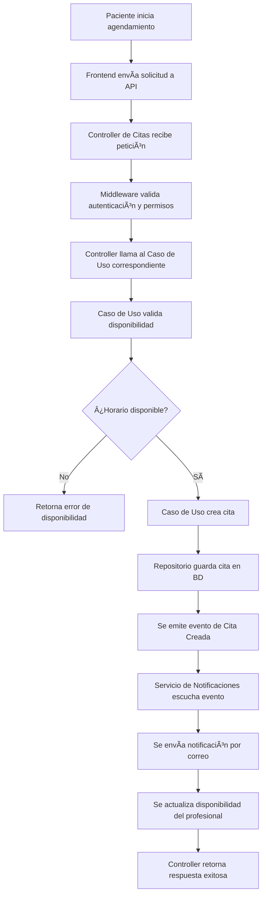
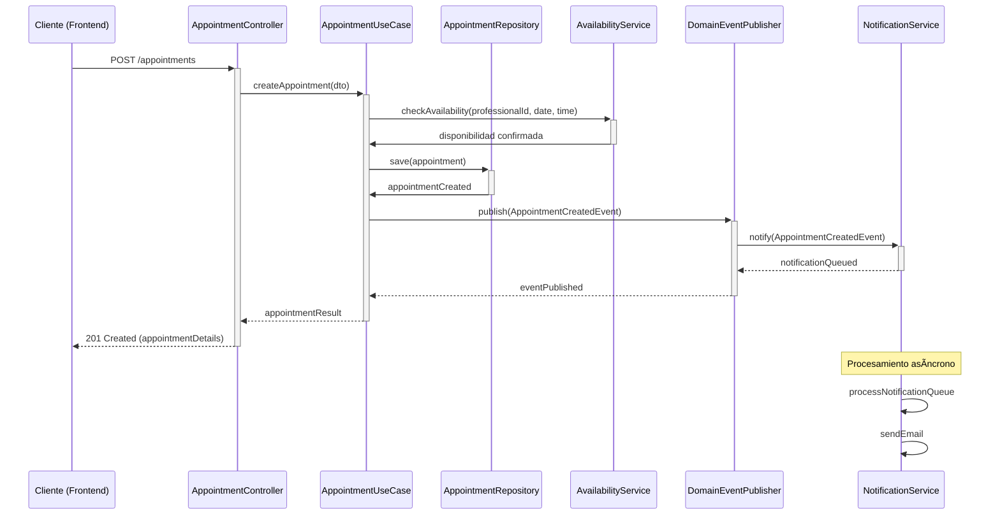

# 📌 Seguimiento de Prompts

## 🛠 Modelo y Herramienta

- **Modelo Utilizado:** claude-3.7-sonnet-thinking
- **Herramienta Aplicada:** Cursor


---

## 📌 Notas y Observaciones  
- [Espacio para anotaciones sobre mejoras, ajustes o resultados esperados]  

---

## 📜 Historial de Prompts  


#### 🔹 Usuario: 

Iniciemos con la creación del **backend** para el proyecto. Actualmente contamos con una aplicación llamada **" @calenconnect-api  "**, desarrollada en **NestJS**.  

### **Antes de comenzar con el desarrollo:**  
Antes de generar archivos, configuraciones o código, es fundamental comprender **qué se debe desarrollar**. Para ello, revisa la documentación disponible en la carpeta **" @documentation  "**, la cual incluye:  
- **PRD (Product Requirements Document)**  
- **ARD (Architecture Requirements Document)**  
- **Historias de usuario relacionadas al backend**  
- **Tickets de trabajo correspondientes**  

### **Primera tarea:**  
1. **Analizar y comprender el sistema** con base en la documentación.  
2. **Generar un resumen detallado** que incluya:  
   - 📌 **Descripción del sistema:** Explica qué se va a desarrollar y su propósito.  
   - 🯠**Objetivo principal:** Define la meta central del backend.  
   - ✅ **Objetivos específicos:** Desglosa metas concretas a alcanzar.  
   - 📅 **Propuesta de fases:** Describe cómo estructurar el desarrollo en etapas para lograr estos objetivos.  

Este proceso se trabajará en **fases**, las cuales se definirán una vez que el contexto esté completamente claro.  


---

#### 🔹 IA:

<think>
Let me approach this methodically. The user wants me to analyze the documentation for a backend project called "calenconnect-api" built with NestJS, and generate a comprehensive summary.

First, I need to read the documentation files that are available in the "documentation" folder:
1. 1-PRD.md - Product Requirements Document
2. 2-ARD.md - Architecture Requirements Document
3. 3-US-Backend.md - User Stories for Backend
4. 4-Tickets-Backend.md - Backend Tickets

I'll start by reading each of these files to understand the project requirements, architecture, and specific tasks for the backend development.
</think>

Voy a analizar la documentación disponible para comprender a fondo el sistema que vamos a desarrollar. Comenzaré revisando los documentos PRD, ARD, historias de usuario y tickets de trabajo.

Read file: documentation/1-PRD.md

Read file: documentation/1-PRD.md

Read file: documentation/2-ARD.md

Read file: documentation/2-ARD.md

Read file: documentation/2-ARD.md

Read file: documentation/3-US-Backend.md

Read file: documentation/4-Tickets-Backend.md

Read file: documentation/4-Tickets-Backend.md

Ran tool


Con base en toda la documentación revisada, he analizado detalladamente el sistema que vamos a desarrollar. Ahora presentaré un resumen estructurado que incluye la descripción del sistema, objetivos y propuesta de fases para el desarrollo del backend.

# Resumen Detallado del Proyecto CalenConnect

## 📌 Descripción del Sistema

**CalenConnect** es una plataforma de agendamiento de citas que permite a pacientes programar sesiones con profesionales de psicología y áreas relacionadas. El sistema gestiona la disponibilidad de los profesionales de manera manual, permitiendo el bloqueo de horarios específicos o días completos. 

El backend está siendo desarrollado con NestJS siguiendo principios de Clean Architecture, Hexagonal Architecture y Domain-Driven Design (DDD) para asegurar escalabilidad y mantenibilidad. La plataforma utiliza Supabase y PostgreSQL como base de datos, aprovechando características como Row Level Security (RLS) para la gestión de permisos.

Características principales del MVP:
- Creación, modificación y cancelación de citas con validación de reglas (como cancelación con mínimo 24 horas de anticipación)
- Gestión de disponibilidad manual por parte de los profesionales
- Mensajes en tiempo real sobre disponibilidad para pacientes
- Sistema de notificaciones por correo electrónico mediante cola de procesamiento

## 🯠Objetivo Principal

Desarrollar un backend robusto y escalable para el Sistema de Agendamiento de Citas que permita gestionar eficientemente las citas entre pacientes y profesionales, cumpliendo con los estándares de seguridad, rendimiento y accesibilidad requeridos.

## ✅ Objetivos Específicos

1. **Arquitectura Modular**: Implementar una estructura backend basada en Clean Architecture y DDD que permita el crecimiento futuro del sistema sin afectar componentes existentes.

2. **Gestión de Disponibilidad**: Desarrollar un módulo que permita a los profesionales gestionar su disponibilidad manualmente, incluyendo el bloqueo de horarios específicos o días completos.

3. **Sistema de Citas**: Implementar la lógica para creación, modificación y cancelación de citas con validación en tiempo real de disponibilidad.

4. **Notificaciones Eficientes**: Crear un sistema de notificaciones por correo electrónico con cola de procesamiento para evitar bloqueos en la API.

5. **Seguridad y Privacidad**: Garantizar la protección de datos personales mediante cifrado en reposo y tránsito, cumpliendo con normativas como GDPR.

6. **Integración con Supabase**: Configurar la autenticación y gestión de base de datos utilizando Supabase, implementando Row Level Security para control de acceso.

7. **Monitoreo y Logs**: Establecer un sistema de logs estructurados para facilitar la detección y resolución de errores.

## 📅 Propuesta de Fases

### Fase 1: Configuración Inicial del Backend (2-3 semanas)
1. **Inicialización del proyecto NestJS** con TypeScript y configuración de entorno
2. **Configuración de la estructura de carpetas** siguiendo principios de Clean Architecture y DDD
3. **Integración con Supabase y PostgreSQL** mediante Prisma ORM
4. **Configuración de seguridad inicial** incluyendo autenticación con Supabase Auth
5. **Implementación de arquitectura base** (controladores, servicios, repositorios)

### Fase 2: Desarrollo del Módulo de Gestión de Disponibilidad (2-3 semanas)
1. **Creación de modelos de datos** para disponibilidad y profesionales
2. **Implementación de endpoints** para gestionar disponibilidad
3. **Desarrollo de la lógica de negocio** para bloqueo de horarios y días
4. **Configuración de Row Level Security** para acceso a datos de disponibilidad
5. **Implementación de validaciones** para la gestión de disponibilidad

### Fase 3: Desarrollo del Módulo de Agendamiento de Citas (2-3 semanas)
1. **Creación de modelos de datos** para citas y pacientes
2. **Implementación de endpoints** para gestión de citas
3. **Desarrollo de la lógica de validación** en tiempo real de disponibilidad
4. **Implementación de reglas de negocio** para modificación y cancelación
5. **Configuración de Row Level Security** para acceso a datos de citas

### Fase 4: Implementación del Sistema de Notificaciones (1-2 semanas)
1. **Configuración del servicio de correo electrónico**
2. **Implementación de cola de procesamiento** para notificaciones
3. **Desarrollo de plantillas de correo** para diferentes tipos de notificaciones
4. **Implementación de servicio de recordatorios** automáticos
5. **Configuración de logs** para monitoreo de entrega de notificaciones

### Fase 5: Pruebas, Optimización y Documentación (2-3 semanas)
1. **Desarrollo de pruebas unitarias e integración**
2. **Optimización de rendimiento** en consultas y operaciones críticas
3. **Implementación de sistema de logs** y monitoreo
4. **Creación de documentación técnica** con Swagger
5. **Preparación para despliegue** en entorno de producción

Esta estructura de fases nos permite un desarrollo incremental, donde cada fase construye sobre la anterior, facilitando las pruebas continuas y asegurando que al final del proceso tengamos un backend robusto y escalable para el MVP.

El tiempo total estimado para el desarrollo del backend es de aproximadamente 9-14 semanas, dependiendo de la complejidad encontrada durante la implementación y los recursos disponibles.


---

#### 🔹 Usuario: 

Con base en esta primera revisión de la documentación, proporciona una **descripción detallada** del proyecto, desglosando cada fase con **pasos específicos**.  

### **Requisitos:**  
✅ **Precisión y objetividad:**  
   - No saques conclusiones precipitadas.  
   - No hagas suposiciones ni tomes atajos.  
   - No tomes decisiones basadas en información incompleta.  

✅ **Claridad y relevancia:**  
   - Evita incluir contenido innecesario, suposiciones o teorías no respaldadas.  
   - No agregues palabrería o ruido; mantén el enfoque en información concreta y verificable.  

✅ **Estructura esperada:**  
   - **Resumen detallado** de la documentación analizada.  
   - **Desglose de cada fase** con pasos bien definidos.  
   - **Flujo de trabajo claro**, asegurando que cada fase esté respaldada por información verificable.  


---

#### 🔹 IA:

<think>
El usuario me pide que proporcione una descripción detallada del proyecto basada en la documentación revisada, desglosando cada fase con pasos específicos. Necesito asegurarme de ser preciso y objetivo, evitando suposiciones y manteniendo el enfoque en la información concreta de la documentación.

Basándome en los documentos revisados (PRD, ARD, Historias de Usuario y Tickets de Backend), puedo estructurar una respuesta que incluya:

1. Un resumen detallado del proyecto
2. El desglose de cada fase con pasos específicos
3. Un flujo de trabajo claro basado en la información documentada

Debo asegurarme de que toda la información que incluya esté directamente respaldada por la documentación y evitar añadir suposiciones o contenido innecesario.
</think>

# Descripción Detallada del Proyecto CalenConnect

## Resumen de la Documentación Analizada

Tras revisar exhaustivamente la documentación del proyecto CalenConnect, que incluye el PRD (Product Requirements Document), ARD (Architecture Requirements Document), Historias de Usuario y Tickets de Backend, he identificado que se trata de un **Sistema de Agendamiento de Citas** desarrollado como MVP (Minimum Viable Product) con las siguientes características clave:

- **Propósito**: Facilitar la programación de citas entre pacientes y profesionales de psicología y áreas relacionadas.
- **Tecnologías clave**: Backend en NestJS, Frontend en NextJS, Base de datos PostgreSQL con Supabase.
- **Arquitectura**: Basada en principios de Clean Architecture, Hexagonal Architecture y Domain-Driven Design (DDD).
- **Funcionalidades principales**: 
  - Creación, modificación y cancelación de citas
  - Gestión manual de disponibilidad de profesionales
  - Mensajes en tiempo real sobre disponibilidad
  - Notificaciones por correo electrónico

El proyecto sigue una estructura modular con separación clara entre capas de dominio, aplicación, infraestructura y presentación, utilizando Supabase para autenticación y base de datos con características como Row Level Security (RLS).

## Desglose Detallado de Fases

### Fase 1: Inicialización y Configuración del Proyecto Backend

**Objetivo**: Establecer la base técnica del proyecto y configurar el entorno de desarrollo.

**Pasos específicos**:
1. **Inicialización del proyecto NestJS**
   - Crear el proyecto con NestJS y TypeScript mediante `npx nest new`
   - Configurar ESLint y Prettier para mantener estándares de código
   - Verificar ejecución en entornos de desarrollo y producción

2. **Definición de la estructura de carpetas**
   - Crear estructura base siguiendo Clean Architecture:
     - `src/domain` (entidades y lógica de negocio)
     - `src/application` (casos de uso)
     - `src/infrastructure` (implementaciones técnicas y conexiones externas)
     - `src/presentation` (controladores y manejo de solicitudes HTTP)
   - Implementar organización basada en Vertical Slicing y Screaming Architecture

3. **Configuración de Supabase y PostgreSQL**
   - Establecer conexión con Supabase PostgreSQL
   - Configurar Prisma ORM para interacción con la base de datos
   - Implementar variables de entorno seguras para conexiones

4. **Configuración de arquitectura base**
   - Implementar controladores base (Controllers)
   - Configurar capa de servicios (Services) para lógica de negocio
   - Implementar capa de repositorios (Repositories) para interacción con base de datos
   - Establecer inyección de dependencias

5. **Documentación inicial del proyecto**
   - Crear README con instrucciones de instalación y ejecución
   - Documentar estructura y arquitectura base

### Fase 2: Implementación de Autenticación y Seguridad

**Objetivo**: Configurar el sistema de autenticación y los mecanismos de seguridad para proteger datos y accesos.

**Pasos específicos**:
1. **Configuración de Supabase Auth**
   - Integrar Supabase Auth en el backend
   - Configurar flujos de autenticación (inicio de sesión, registro, cierre de sesión)
   - Implementar validación de tokens JWT

2. **Implementación de gestión de roles y permisos**
   - Configurar roles de usuario (paciente y profesional)
   - Implementar Row Level Security (RLS) en Supabase
   - Asegurar validación de permisos en el backend antes de operaciones

3. **Configuración de seguridad de datos**
   - Implementar cifrado en reposo para datos sensibles
   - Configurar TLS/HTTPS para cifrado en tránsito
   - Establecer políticas de almacenamiento seguro de tokens
   - Definir políticas de retención y eliminación de datos

4. **Implementación de comunicación segura con Supabase**
   - Crear capa de abstracción para interactuar con Supabase
   - Configurar métodos para autenticación y validación de tokens
   - Implementar mecanismo de manejo de errores y reintentos

5. **Documentación de seguridad**
   - Documentar medidas de seguridad implementadas
   - Detallar políticas de acceso y protección de datos

### Fase 3: Desarrollo del Módulo de Gestión de Disponibilidad

**Objetivo**: Implementar la funcionalidad que permite a los profesionales gestionar su disponibilidad.

**Pasos específicos**:
1. **Creación de modelos de datos para disponibilidad**
   - Implementar la entidad `AVAILABILITY` en el dominio
   - Definir relaciones con la entidad `USERS` (profesionales)
   - Crear DTOs (Data Transfer Objects) para operaciones de disponibilidad

2. **Implementación de endpoints para gestión de disponibilidad**
   - Crear controladores para operaciones CRUD de disponibilidad
   - Implementar validación de parámetros de entrada
   - Configurar rutas protegidas accesibles solo para profesionales

3. **Desarrollo de lógica de negocio para disponibilidad**
   - Implementar casos de uso para crear y modificar disponibilidad
   - Configurar bloqueo de horarios específicos o días completos
   - Establecer reglas de negocio para validación de disponibilidad

4. **Configuración de Row Level Security para disponibilidad**
   - Implementar políticas RLS para asegurar que los profesionales solo modifiquen su propia disponibilidad
   - Configurar acceso de consulta para pacientes

5. **Implementación de validaciones para gestión de disponibilidad**
   - Validar consistencia de horarios (sin solapamientos)
   - Implementar validaciones para evitar modificaciones de disponibilidad ya reservada
   - Establecer reglas para fechas y horarios válidos

### Fase 4: Desarrollo del Módulo de Agendamiento de Citas

**Objetivo**: Implementar la funcionalidad que permite a los pacientes agendar citas con profesionales.

**Pasos específicos**:
1. **Creación de modelos de datos para citas**
   - Implementar la entidad `APPOINTMENTS` en el dominio
   - Definir relaciones con entidades `USERS` (pacientes y profesionales)
   - Crear DTOs para operaciones de citas

2. **Implementación de endpoints para gestión de citas**
   - Crear controladores para operaciones CRUD de citas
   - Implementar validación de parámetros de entrada
   - Configurar rutas para creación, modificación y cancelación de citas

3. **Desarrollo de lógica de validación en tiempo real**
   - Implementar verificación de disponibilidad en tiempo real
   - Configurar bloqueo temporal durante el proceso de selección
   - Desarrollar mensajes de respuesta para validaciones

4. **Implementación de reglas de negocio para citas**
   - Configurar restricción de modificación/cancelación con menos de 24 horas de anticipación
   - Implementar actualización automática de disponibilidad al agendar
   - Establecer validaciones de horarios válidos para citas

5. **Configuración de Row Level Security para citas**
   - Implementar políticas RLS para asegurar que los pacientes solo accedan a sus propias citas
   - Configurar acceso para profesionales a las citas asignadas

### Fase 5: Implementación del Sistema de Notificaciones

**Objetivo**: Desarrollar el sistema que gestionará las notificaciones por correo electrónico.

**Pasos específicos**:
1. **Configuración del servicio de correo electrónico**
   - Implementar integración con servicio de correo
   - Configurar plantillas para diferentes tipos de notificaciones
   - Establecer parámetros de conexión segura

2. **Implementación de cola de procesamiento**
   - Crear estructura para procesamiento asíncrono de notificaciones
   - Implementar estrategia de reintentos para envíos fallidos
   - Configurar manejo de errores y registro de eventos

3. **Desarrollo de lógica de notificaciones**
   - Implementar casos de uso para confirmación de citas
   - Configurar notificaciones de modificación y cancelación
   - Desarrollar sistema de recordatorios automáticos (24h y 1h antes)

4. **Integración con el módulo de citas**
   - Configurar emisión de eventos desde operaciones de citas
   - Implementar suscripción a eventos para disparar notificaciones
   - Establecer trazabilidad entre citas y notificaciones

5. **Implementación de registro de notificaciones**
   - Crear estructura para almacenar historial de notificaciones
   - Configurar registro de intentos de envío y estados
   - Implementar consulta de estado de notificaciones

### Fase 6: Implementación de Logs, Monitoreo y Documentación Técnica

**Objetivo**: Establecer mecanismos de seguimiento, monitoreo y documentación del sistema.

**Pasos específicos**:
1. **Configuración del sistema de logs**
   - Implementar sistema de logs estructurados
   - Configurar registro de eventos importantes (autenticaciones, errores, operaciones críticas)
   - Establecer niveles de logs (error, warning, info, debug)

2. **Implementación de sistema de monitoreo**
   - Configurar captura de métricas de rendimiento
   - Implementar alertas para eventos críticos
   - Establecer dashboard para visualización de estado del sistema

3. **Desarrollo de pruebas unitarias e integración**
   - Implementar pruebas para cada módulo
   - Configurar pruebas de integración entre módulos
   - Establecer CI/CD para ejecución automatizada de pruebas

4. **Creación de documentación técnica**
   - Implementar Swagger para documentación de API
   - Documentar arquitectura y patrones implementados
   - Crear guías para desarrollo y mantenimiento

5. **Preparación para despliegue**
   - Configurar variables de entorno para producción
   - Establecer scripts de despliegue
   - Documentar proceso de puesta en producción

## Flujo de Trabajo Integral

El desarrollo seguirá un flujo incremental donde cada fase construye sobre las anteriores:

1. **Base técnica sólida**: La Fase 1 establece la infraestructura y arquitectura necesarias para todo el proyecto.

2. **Seguridad primero**: La Fase 2 implementa la autenticación y seguridad, aspectos cruciales antes de desarrollar funcionalidades.

3. **Núcleo funcional**: Las Fases 3 y 4 implementan las funcionalidades centrales del sistema (disponibilidad y citas).

4. **Experiencia mejorada**: La Fase 5 añade el sistema de notificaciones que enriquece la experiencia de uso.

5. **Calidad y estabilidad**: La Fase 6 asegura el monitoreo, documentación y calidad general del sistema.

Este enfoque garantiza que cada componente se desarrolle sobre una base estable, siguiendo los principios arquitectónicos definidos en la documentación (Clean Architecture, Hexagonal Architecture y DDD), asegurando la modularidad y escalabilidad del sistema para futuras expansiones.


---

#### 🔹 Usuario: 

El desarrollo del proyecto seguirá un **flujo incremental**, en el que cada fase construye sobre la anterior.  

### **📌 Fase 1: Base Técnica Sólida**  
Esta primera fase es **crucial**, ya que establece los fundamentos de la infraestructura y arquitectura del proyecto. Para garantizar una arquitectura escalable, mantenible y alineada con buenas prácticas, el desarrollo debe cumplir con:  

#### **🛠 Cumplimiento de Arquitecturas y Principios:**  
- **Diseño Dirigido por el Dominio (DDD)**  
- **Arquitectura Hexagonal**  
- **Vertical Slicing**  
- **Screaming Architecture**  
- **Clean Architecture**  
- **SOLID y DRY**  

#### **📌 Patrones de Diseño Aplicables (En casos específicos):**  
- **Singleton** → Asegura una única instancia de una clase con un punto de acceso global.  
- **Factory** → Permite la creación de objetos sin especificar su clase exacta.  
- **Observer** → Facilita la comunicación entre objetos cuando hay cambios en su estado.  
- **Strategy** → Permite definir y cambiar algoritmos de forma intercambiable.  

Además, se debe garantizar una **separación modular**, dividiendo el sistema en módulos independientes que permitan la escalabilidad y el mantenimiento eficiente del proyecto.  

---

### **📌 Tarea a realizar:**  
Con base en estos lineamientos, **propón una primera versión de la estructura del proyecto**, asegurando que:  
1. **Defina una estructura de carpetas y módulos** siguiendo las arquitecturas y principios mencionados.  
2. **Incluya una descripción detallada** justificando la organización propuesta y su impacto en la escalabilidad y mantenibilidad del sistema.  
3. **Proporcione diagramas visuales** para facilitar la comprensión:  
   - 📠**Diagrama de flujo** → Representación del flujo de ejecución y procesos clave.  
   - 📠**Diagrama de secuencia** → Descripción de la interacción entre módulos y componentes en tiempo de ejecución.  


---

#### 🔹 IA:

<think>Necesito proponer una estructura de proyecto para el backend de CalenConnect que cumpla con los principios arquitectónicos mencionados:
- DDD (Domain-Driven Design)
- Arquitectura Hexagonal
- Vertical Slicing
- Screaming Architecture
- Clean Architecture
- SOLID y DRY

También debo considerar los patrones de diseño mencionados y asegurar una separación modular adecuada.

Basado en la documentación, voy a diseñar una estructura que:
1. Separe claramente el dominio, aplicación, infraestructura y presentación
2. Organice el código por funcionalidades (vertical slicing)
3. Haga evidente el propósito del sistema desde la estructura (screaming architecture)
4. Permita la inyección de dependencias y el uso de los patrones mencionados

La estructura debe ser escalable para acomodar futuras funcionalidades más allá del MVP.</think>

# Propuesta de Estructura del Proyecto - CalenConnect API

## Estructura de Carpetas y Módulos

Basado en los requerimientos arquitectónicos, propongo la siguiente estructura de carpetas para el proyecto NestJS de CalenConnect, diseñada para cumplir con DDD, Arquitectura Hexagonal, Vertical Slicing, Screaming Architecture y Clean Architecture:

```
/apps/calenconnect-api/src/
├── main.ts                            # Punto de entrada de la aplicación
├── app.module.ts                      # Módulo principal que registra otros módulos
│
├── config/                            # Configuraciones globales
│   ├── environment/                   # Variables de entorno y configuración
│   ├── database/                      # Configuración de base de datos
│   └── security/                      # Configuración de seguridad
│
├── common/                            # Código compartido entre módulos
│   ├── exceptions/                    # Excepciones personalizadas
│   ├── decorators/                    # Decoradores personalizados
│   ├── interfaces/                    # Interfaces comunes
│   ├── utils/                         # Utilidades generales
│   └── constants/                     # Constantes globales
│
├── modules/                           # Organización por dominio funcional (Vertical Slicing)
│   ├── user/                          # Módulo de gestión de usuarios
│   │   ├── domain/                    # Capa de dominio (DDD)
│   │   │   ├── entities/              # Entidades de dominio
│   │   │   ├── value-objects/         # Objetos de valor
│   │   │   ├── repositories/          # Interfaces de repositorios
│   │   │   └── services/              # Servicios de dominio
│   │   │
│   │   ├── application/               # Capa de aplicación
│   │   │   ├── commands/              # Comandos (patrón CQRS)
│   │   │   ├── queries/               # Consultas (patrón CQRS)
│   │   │   ├── dtos/                  # Objetos de transferencia de datos
│   │   │   └── use-cases/             # Casos de uso
│   │   │
│   │   ├── infrastructure/            # Capa de infraestructura
│   │   │   ├── persistence/           # Implementación de repositorios
│   │   │   │   ├── prisma/            # Implementaciones con Prisma
│   │   │   │   └── models/            # Modelos de base de datos
│   │   │   │
│   │   │   └── external/              # Servicios externos (Supabase Auth)
│   │   │
│   │   └── presentation/              # Capa de presentación
│   │       ├── controllers/           # Controladores REST
│   │       ├── middlewares/           # Middlewares específicos
│   │       ├── validators/            # Validadores de entrada
│   │       └── user.module.ts         # Módulo de NestJS para usuarios
│   │
│   ├── appointment/                   # Módulo de gestión de citas
│   │   ├── domain/
│   │   ├── application/
│   │   ├── infrastructure/
│   │   └── presentation/
│   │
│   ├── availability/                  # Módulo de gestión de disponibilidad
│   │   ├── domain/
│   │   ├── application/
│   │   ├── infrastructure/
│   │   └── presentation/
│   │
│   └── notification/                  # Módulo de gestión de notificaciones
│       ├── domain/
│       ├── application/
│       ├── infrastructure/
│       └── presentation/
│
└── shared-kernel/                     # Kernel compartido (conceptos de dominio comunes)
    ├── events/                        # Eventos de dominio compartidos
    ├── interfaces/                    # Interfaces compartidas entre dominios
    └── value-objects/                 # Objetos de valor compartidos
```

## Justificación de la Organización Propuesta

### 1. Aplicación de Principios Arquitectónicos

#### Domain-Driven Design (DDD)
- **Separación por dominios funcionales**: La estructura se organiza en base a los dominios principales del sistema (usuarios, citas, disponibilidad, notificaciones).
- **Entidades y objetos de valor**: Cada módulo contiene su propia carpeta de dominio con entidades y objetos de valor.
- **Servicios de dominio**: La lógica de negocio se encapsula en servicios de dominio que expresan operaciones significativas del dominio.
- **Shared Kernel**: Se incluye un kernel compartido para conceptos y comportamientos comunes entre dominios.

#### Arquitectura Hexagonal (Ports & Adapters)
- **Puertos**: Las interfaces en la capa de dominio (como repositories) definen puertos que expresan lo que el dominio necesita.
- **Adaptadores**: Las implementaciones en la capa de infraestructura adaptan tecnologías específicas a los puertos definidos.
- **Independencia tecnológica**: El dominio no depende de detalles de infraestructura, permitiendo cambiar tecnologías sin afectar la lógica de negocio.

#### Vertical Slicing
- **Organización por funcionalidad**: Cada módulo contiene todas las capas necesarias para su funcionamiento, desde el dominio hasta la presentación.
- **Modularidad completa**: Los módulos contienen todo lo necesario para implementar una característica específica, facilitando el desarrollo paralelo.

#### Screaming Architecture
- **Propósito evidente**: La estructura de carpetas comunica claramente que se trata de un sistema de agendamiento con módulos para usuarios, citas, disponibilidad y notificaciones.
- **Intención antes que implementación**: Los nombres reflejan conceptos de negocio en lugar de detalles técnicos.

#### Clean Architecture
- **Separación en capas**: Cada módulo se divide en capas de dominio, aplicación, infraestructura y presentación.
- **Regla de dependencia**: Las dependencias apuntan hacia adentro (dominio), nunca hacia afuera.
- **Independencia de frameworks**: La lógica de negocio no depende directamente de NestJS o Prisma.

#### SOLID y DRY
- **Responsabilidad única**: Cada clase tiene una única responsabilidad.
- **Inversión de dependencias**: Se utilizan interfaces para que las clases de alto nivel no dependan de las de bajo nivel.
- **No repetición**: La estructura evita duplicación mediante el uso de módulos comunes y compartidos.

### 2. Aplicación de Patrones de Diseño

- **Singleton**: Aplicado en servicios de configuración y conexiones a bases de datos.
- **Factory**: Implementado en la creación de entidades complejas dentro de los casos de uso.
- **Observer**: Utilizado en el sistema de notificaciones para comunicar eventos entre módulos.
- **Strategy**: Aplicado en servicios que pueden tener múltiples implementaciones (como diferentes formas de enviar notificaciones).

### 3. Impacto en Escalabilidad y Mantenibilidad

#### Escalabilidad
- **Modularidad completa**: Nuevas funcionalidades pueden añadirse como módulos independientes sin afectar a los existentes.
- **Separación de responsabilidades**: Facilita el crecimiento del sistema y la distribución del trabajo en equipos.
- **Desacoplamiento**: Permite escalar componentes específicos de forma independiente.
- **Preparado para microservicios**: La estructura modular facilita la posible migración a microservicios en el futuro.

#### Mantenibilidad
- **Localización de cambios**: Las modificaciones se concentran en módulos específicos, minimizando el impacto en el resto del sistema.
- **Testabilidad mejorada**: La separación de capas facilita la implementación de pruebas unitarias y de integración.
- **Documentación implícita**: La estructura comunica claramente la organización y propósito del sistema.
- **Onboarding eficiente**: Nuevos desarrolladores pueden entender rápidamente cómo está organizado el proyecto.

## Diagramas Visuales

### Diagrama de Flujo: Proceso de Agendamiento de Citas



### Diagrama de Secuencia: Interacción entre Módulos



## Ventajas Adicionales de la Estructura Propuesta

1. **Facilita el trabajo en equipo**: Diferentes equipos pueden trabajar en módulos separados sin conflictos.

2. **Mejora la calidad del código**: La estructura fomenta buenas prácticas y separación de responsabilidades.

3. **Reduce la deuda técnica**: El diseño inicial sólido minimiza la necesidad de refactorizaciones mayores en el futuro.

4. **Favorece la evolución del sistema**: La arquitectura permite añadir nuevas funcionalidades o cambiar tecnologías con impacto mínimo.

5. **Mejora la seguridad**: La separación clara de responsabilidades reduce riesgos de vulnerabilidades y facilita la implementación de medidas de seguridad.

Esta estructura proporciona una base sólida para el desarrollo del backend de CalenConnect, asegurando que el sistema pueda crecer y evolucionar manteniendo su calidad e integridad arquitectónica.


---

#### 🔹 Usuario: 

Debemos aplicar mejoras a la **primera entrega** del proyecto, optimizando la organización del código y la estructura del proyecto en **NestJS**.  

### **📌 Mejoras a Implementar:**  

#### **1ï¸âƒ£ Organización del código compartido**  
- La lógica **compartida** y las **configuraciones globales** deberán ubicarse en la carpeta **` @libs  `**.  
- La aplicación principal (` @apps  `) solo contendrá la lógica específica del proyecto, manteniendo un código más limpio y modular.  

#### **2ï¸âƒ£ Uso de Guards en lugar de Middlewares**  
- En lugar de **middlewares**, se utilizarán **guards**, ya que NestJS ofrece esta opción de manera nativa.  
- Si los guards son reutilizables en varias partes del sistema, deberán organizarse dentro de **`libs`**, siguiendo una estructura modular.  

#### **3ï¸âƒ£ Configuración centralizada en `  @config.yaml  `**  
- El proyecto ya cuenta con una configuración base en **`config.yaml`**, donde se manejan parámetros clave como el **puerto de la aplicación**.  
- En la nueva estructura de directorios, se debe respetar la existencia de las carpetas y archivos actuales encargados de gestionar esta configuración.  
- Se debe proporcionar una **explicación clara del uso de estos archivos** dentro del proyecto.  

#### **4ï¸âƒ£ Estructura modular en `libs`**  
- Todo lo que se ubique dentro de `libs` deberá estar **estructurado de manera modular**, similar a la carpeta existente **`config-manager`**.  
- Este enfoque garantizará que el proyecto sea más escalable y organizado.  

---

### **📌 Tarea a realizar:**  
1. **Proponer una nueva estructura de directorios** que incorpore estas mejoras, asegurando que:  
   - La configuración global y lógica compartida se ubiquen en `libs`.  
   - Guards reemplacen middlewares y se organicen adecuadamente.  
   - Se mantenga la carpeta y archivos actuales para `config.yaml`.  
2. **Explicar detalladamente** cada cambio realizado y su propósito.  
3. **Justificar cómo esta nueva estructura contribuye a la modularidad y escalabilidad del proyecto.**  


---

#### 🔹 IA:

<think>Basado en la nueva información proporcionada, voy a analizar la estructura actual y proponer mejoras según los requisitos específicos. Observo que el proyecto está dividido en dos carpetas principales:

1. `/apps/calenconnect-api` - Contiene la aplicación principal
2. `/libs/infrastructure` - Parece contener código compartido o infraestructura

También hay un archivo `config.yaml` que maneja configuraciones globales como el puerto de la aplicación y parámetros de Supabase.

Los requisitos para la nueva estructura son:
- Mover lógica compartida y configuraciones globales a `/libs`
- Usar Guards en lugar de Middlewares (y ubicarlos en `/libs` si son reutilizables)
- Mantener la configuración centralizada en `config.yaml`
- Estructurar el contenido de `/libs` de manera modular

Necesito proponer una estructura que cumpla con estos requisitos y explicar cada cambio.</think># Propuesta de Nueva Estructura de Directorios para CalenConnect API

## Análisis de la Estructura Actual

Actualmente, el proyecto está organizado en dos carpetas principales:

- `/apps/calenconnect-api`: Contiene la aplicación principal de NestJS
- `/libs/infrastructure`: Contiene componentes de infraestructura compartidos

Además, existe un archivo `config.yaml` que centraliza configuraciones como el puerto de la aplicación y los parámetros de conexión a Supabase.

## Nueva Estructura de Directorios Propuesta

Propongo la siguiente estructura mejorada que incorpora los requisitos especificados:

```
/
├── apps/
│   └── calenconnect-api/               # Aplicación principal
│       ├── src/
│       │   ├── main.ts                 # Punto de entrada
│       │   ├── app.module.ts           # Módulo principal
│       │   └── modules/                # Módulos de dominio específicos
│       │       ├── appointment/        # Módulo de citas
│       │       ├── availability/       # Módulo de disponibilidad
│       │       ├── user/               # Módulo de usuarios
│       │       └── notification/       # Módulo de notificaciones
│       │
│       └── tsconfig.app.json           # Configuración TypeScript específica
│
├── libs/                               # Código compartido y reutilizable
│   ├── config/                         # Configuración centralizada
│   │   ├── src/
│   │   │   ├── config.module.ts        # Módulo de configuración
│   │   │   ├── config.service.ts       # Servicio para acceder a la configuración
│   │   │   ├── yaml-loader.service.ts  # Servicio para cargar archivos YAML
│   │   │   └── interfaces/             # Interfaces de configuración
│   │   └── index.ts                    # Punto de entrada del módulo
│   │
│   ├── core/                           # Componentes centrales
│   │   ├── src/
│   │   │   ├── guards/                 # Guards reutilizables
│   │   │   │   ├── auth.guard.ts       # Guard de autenticación
│   │   │   │   ├── roles.guard.ts      # Guard de roles
│   │   │   │   └── index.ts            # Exportaciones
│   │   │   │
│   │   │   ├── decorators/             # Decoradores personalizados
│   │   │   ├── interceptors/           # Interceptores
│   │   │   ├── filters/                # Filtros de excepción
│   │   │   └── interfaces/             # Interfaces compartidas
│   │   └── index.ts                    # Punto de entrada del módulo
│   │
│   ├── domain-events/                  # Sistema de eventos de dominio
│   │   ├── src/
│   │   │   ├── event-bus.module.ts     # Módulo de bus de eventos
│   │   │   ├── event-bus.service.ts    # Servicio de publicación/suscripción
│   │   │   ├── interfaces/             # Interfaces de eventos
│   │   │   └── decorators/             # Decoradores para eventos
│   │   └── index.ts                    # Punto de entrada del módulo
│   │
│   ├── infrastructure/                 # Componentes de infraestructura
│   │   ├── src/
│   │   │   ├── database/               # Acceso a base de datos
│   │   │   │   ├── prisma/             # Cliente Prisma y módulo
│   │   │   │   └── supabase/           # Cliente Supabase y módulo
│   │   │   │
│   │   │   ├── email/                  # Servicio de correo electrónico
│   │   │   ├── queue/                  # Servicio de cola para procesamiento asíncrono
│   │   │   ├── logging/                # Servicio de logging
│   │   │   └── external-services/      # Integración con servicios externos
│   │   └── index.ts                    # Punto de entrada del módulo
│   │
│   └── shared/                         # Utilidades compartidas
│       ├── src/
│       │   ├── utils/                  # Funciones auxiliares
│       │   ├── constants/              # Constantes
│       │   ├── types/                  # Tipos personalizados
│       │   └── errors/                 # Clases de error personalizadas
│       └── index.ts                    # Punto de entrada del módulo
│
├── config.yaml                         # Archivo de configuración centralizado
├── nest-cli.json                       # Configuración de NestJS
├── package.json                        # Dependencias del proyecto
└── tsconfig.json                       # Configuración TypeScript base
```

## Explicación Detallada de los Cambios

### 1ï¸âƒ£ Organización del código compartido en `libs`

En la nueva estructura, he movido toda la lógica compartida y configuraciones globales a la carpeta `libs`, organizándola en módulos especializados:

- **`/libs/config`**: 
  - Este módulo encapsula toda la lógica relacionada con la carga y gestión de configuraciones del archivo `config.yaml`.
  - Proporciona un servicio de configuración (`ConfigService`) que cualquier parte de la aplicación puede inyectar para acceder a los parámetros de configuración.
  - El `YamlLoaderService` se encarga de cargar y analizar el archivo YAML.

- **`/libs/core`**: 
  - Contiene componentes fundamentales como guards, decoradores, interceptores y filtros que se utilizan en toda la aplicación.
  - Los guards de autenticación y roles ahora se colocan aquí, siguiendo la recomendación de usar guards en lugar de middlewares.

- **`/libs/domain-events`**: 
  - Implementa un sistema de eventos de dominio para la comunicación entre módulos desacoplados.
  - Facilita la implementación de patrones como CQRS y Event Sourcing.

- **`/libs/infrastructure`**: 
  - Encapsula todos los detalles de infraestructura como la base de datos, email, colas y servicios externos.
  - La conexión a Supabase y Prisma está aislada aquí, lo que facilita cambios o actualizaciones futuras.

- **`/libs/shared`**: 
  - Proporciona utilidades, constantes y tipos compartidos entre todos los módulos.
  - Centraliza la definición de errores personalizados para mantener consistencia.

### 2ï¸âƒ£ Uso de Guards en lugar de Middlewares

He reemplazado los middlewares por guards, siguiendo las buenas prácticas de NestJS:

- Los guards ahora se definen en `/libs/core/src/guards/` y pueden ser reutilizados en toda la aplicación.
- Esto aprovecha mejor el sistema de inyección de dependencias de NestJS, permitiendo que los guards accedan a servicios como el de configuración o autenticación.
- Ejemplos incluidos:
  - `auth.guard.ts`: Verifica que el usuario esté autenticado
  - `roles.guard.ts`: Verifica que el usuario tenga los roles necesarios para acceder a un recurso

### 3ï¸âƒ£ Configuración centralizada en `config.yaml`

He mantenido el archivo `config.yaml` en la raíz del proyecto y he creado una estructura específica para gestionarlo:

- El módulo `/libs/config` es responsable de cargar y proporcionar acceso a esta configuración.
- `ConfigService` ofrece métodos tipados para acceder a los diferentes valores de configuración.
- Este enfoque permite:
  - Centralizar toda la configuración en un solo lugar
  - Validar la configuración al inicio de la aplicación
  - Proporcionar valores predeterminados cuando sea necesario
  - Cargar diferentes configuraciones según el entorno (desarrollo, prueba, producción)

### 4ï¸âƒ£ Estructura modular en `libs`

Cada módulo en `libs` sigue una estructura consistente:

- Un directorio `src` que contiene toda la implementación
- Un archivo `index.ts` que actúa como punto de entrada y exporta los componentes públicos
- Una organización interna consistente con subdirectorios para diferentes tipos de componentes

Este enfoque modular permite:
- Importar sólo lo que se necesita
- Mantener una clara separación de responsabilidades
- Facilitar las pruebas unitarias
- Mejorar la mantenibilidad del código

## Justificación de la Nueva Estructura

### Modularidad Mejorada

La nueva estructura promueve una alta modularidad a través de:

1. **Separación Clara de Responsabilidades**: Cada módulo en `libs` tiene un propósito específico y bien definido.
2. **Encapsulación**: Los detalles internos de cada módulo están ocultos, exponiendo solo las interfaces necesarias.
3. **Composición**: Los módulos de la aplicación principal (`apps`) pueden componer funcionalidades reutilizando los módulos de `libs`.
4. **Bajo Acoplamiento**: Los módulos de dominio en `apps` dependen de abstracciones definidas en `libs`, no de implementaciones concretas.

### Escalabilidad Mejorada

La estructura propuesta facilita la escalabilidad de varias maneras:

1. **Crecimiento Horizontal**: Se pueden añadir nuevos módulos de dominio sin modificar los existentes.
2. **Extensibilidad Vertical**: Se pueden añadir nuevas funcionalidades a los módulos existentes sin afectar a otros.
3. **Rendimiento**: La separación de servicios facilita la implementación de patrones como CQRS o Event Sourcing para escalar componentes específicos.
4. **Evolución Incremental**: La estructura permite evolucionar diferentes partes del sistema a diferentes velocidades según las necesidades.

### Beneficios Adicionales

1. **Desarrollo en Equipo**: Equipos diferentes pueden trabajar en módulos separados sin conflictos.
2. **Testabilidad**: La clara separación de responsabilidades facilita la escritura de pruebas unitarias e integración.
3. **Gestión de Dependencias**: Centraliza las dependencias comunes, evitando duplicación.
4. **Onboarding**: Facilita la incorporación de nuevos desarrolladores al proyecto, ya que la estructura es intuitiva y sigue patrones estándar.
5. **Preparación para Microservicios**: Si en el futuro se decide migrar a una arquitectura de microservicios, la estructura modular facilitará esta transición.

Esta estructura propuesta proporciona un equilibrio óptimo entre modularidad, escalabilidad y practicidad, adhiriéndose a las mejores prácticas de NestJS y los principios de diseño de software modernos.


---

#### 🔹 Usuario: 


---

#### 🔹 IA:


---

#### 🔹 Usuario: 


---

#### 🔹 IA:


